# Projeto de Controladores

<!--% Diretório atual: pwd
'/Users/fernandopassold/Documents/GitHub/fpassold.github.io/Process_Sinais_Controle_ECP/2024_1'
-->

Continuação da [aula de 29/04/2024](aula_29042024.html) depois de passar pelo [Resumo](https://fpassold.github.io/Controle_3/pd_plus_filtro.pdf) de  controladores com ação derivativa:

```matlab
>> load planta
```

💾 Arquivo: [planta.mat](planta.mat).

## Projeto de PD

Equação genérica do PD:

$C_{PD}(z)=\dfrac{K(z-z_{PD})}{z}$

O pólo fica em $z=0$ (na origem) e nossa única incógnita é a posição do zero, $z_{PD}$.

A posição do zero do PD depende dos pólos e zeros da planta.

Lembrando da eq. da planta:

```matlab
>> zpk(BoG)
 
   0.0020446 (z+2.867) (z+0.2013)
  --------------------------------
  (z-0.9048) (z-0.8187) (z-0.4493)
 
Sample time: 0.1 seconds
Discrete-time zero/pole/gain model.
```

Considerando o acréscimo de um controlador PD aos pólos e zeros da planta, $BoG(z)$ temos 3 opções em vista:

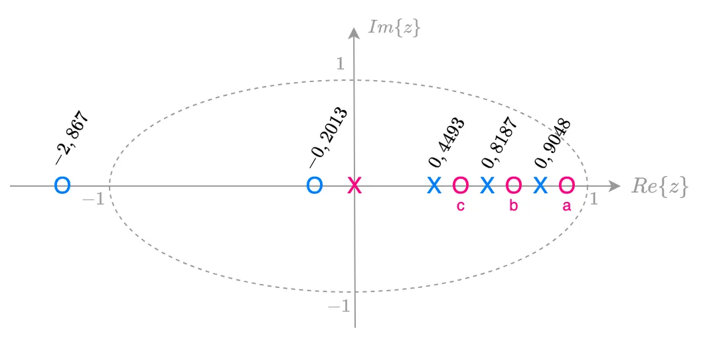

Sendo as 3 opções:

* a) zero do PD em: $0,9048 < z < 1$ (entre o pólo mais lento da planta e o círculo unitário, mas sem estar sobre o círculo unitário);
* b) zero do PD em: $0,8187 < z < 0,9048$ (entre os 2 pólos mais lentos da planta);
* c) zero do PD em: $0,4493 < z < 0,8187$ (entre os 2 pólos não tão lentos da planta).

Graficamente:

A **opção "a"** resulta no RL similar ao mostrado abaixo:

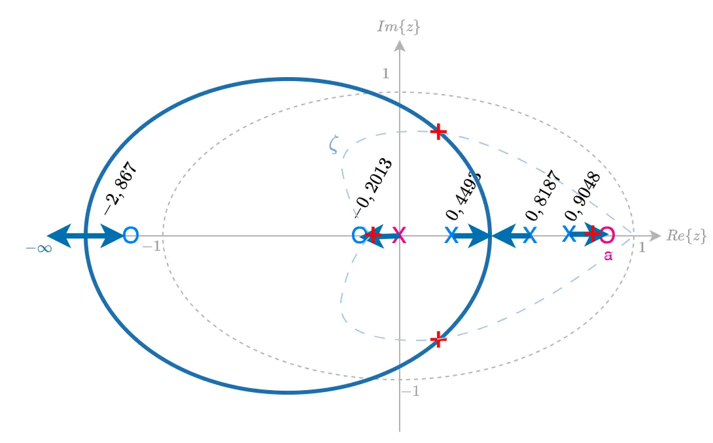

Notamos que ficamos com um pólo dominante em MF, real, muito próximo do círculo unitário (tendendo para a posição do zero do PD).

A **opção "b"** resulta neste outro RL:

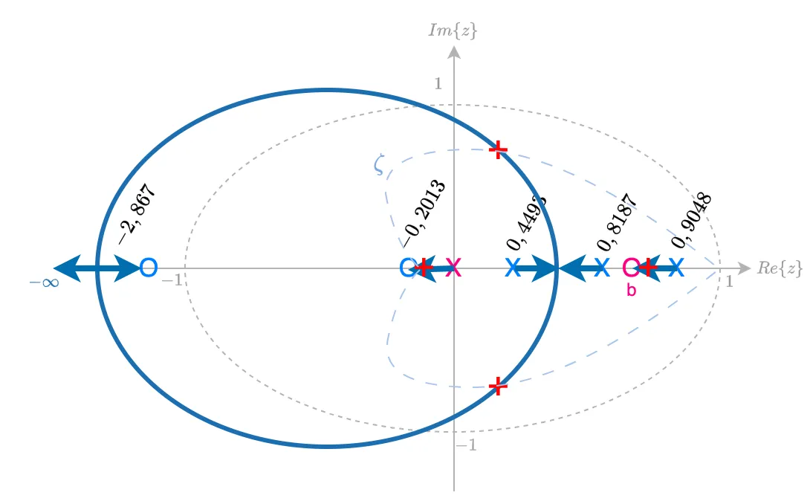

Esta opção é melhor que a opção anterior, porque o pólo de MF real dominante ao invés de caminhar na direção do circulo unitário (implicando atraso na resposta do sistema), "caminha" justamente para o outro lado, para $z \to -\infty$, o que garante uma resposta mais rápida em comparação com a opção "a".

E a **opção "c"** resulta no proximo RL:

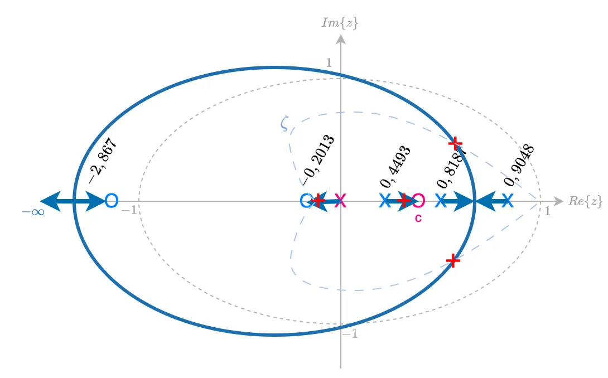

Esta opção cria um par de pólos de MF dominantes complexos, aparentemente mais próximos do círculo unitário (mais lentos) que em comparação com os pólos de MF dominantes da opção anterior "b".

Uma **4a-opção, opção"d"** surge quando pensamos que podemos cancelar o pólo mais lento da planta (em $z=0,9048$), colocando o zero do PD sobre o mesmo. Neste caso, temos um "ganho" extra que seria reduzir a complexidade do sistema. Com as outras opções obtemos um sistema de 4a-ordem em MF. Com esta opção, ficamos um sistema em MF de 3a-ordem. Este RL ficaria algo como:

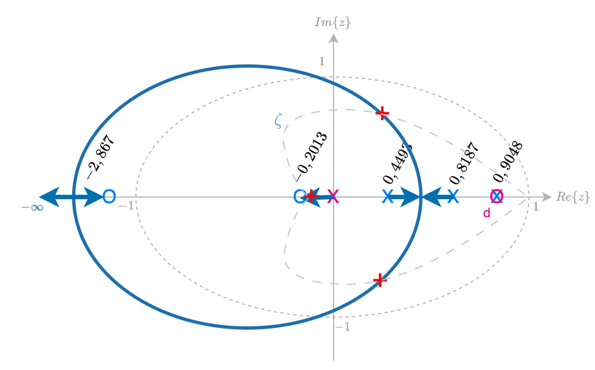

Esta opção parece a mais promissora. Reduz a complexidade do sistema, e garante um par de pólos complexos de MF dominantes, afastado do círculo unitário.

### Projeto do PD "b"

O zero do PD fica em: $0,8187 \le z \le 0,9048$ (entre os 2 pólos + lentos da planta):

```matlab
>> ze_PD=(0.9048+0.8187)/2
ze_PD =
      0.86175
>> C_PDb=tf(poly(ze_PD),[1 0],T)

C_PDb =
 
  z - 0.8618
  ----------
      z
 
Sample time: 0.1 seconds
Discrete-time transfer function.

>> ftma_PDb=C_PDb*BoG;
>> zpk(ftma_PDb)
 
  0.0020446 (z+2.867) (z-0.8618) (z+0.2013)
  -----------------------------------------
     z (z-0.9048) (z-0.8187) (z-0.4493)
 
Sample time: 0.1 seconds
Discrete-time zero/pole/gain model.

>> rlocus(ftma_PDb)
>> hold on; zgrid(zeta,0)
>> axis([0.3 1.1 -0.2 0.6]) % zoom na região de interesse
>> [K_PDb,polosMF]=rlocfind(ftma_PDb)
Select a point in the graphics window
selected_point =
      0.65484 +    0.38453i
K_PDb =
        21.38
polosMF =
      0.86556 +          0i
      0.65366 +    0.38451i
      0.65366 -    0.38451i
    -0.043689 +          0i
```

RL deste PD:

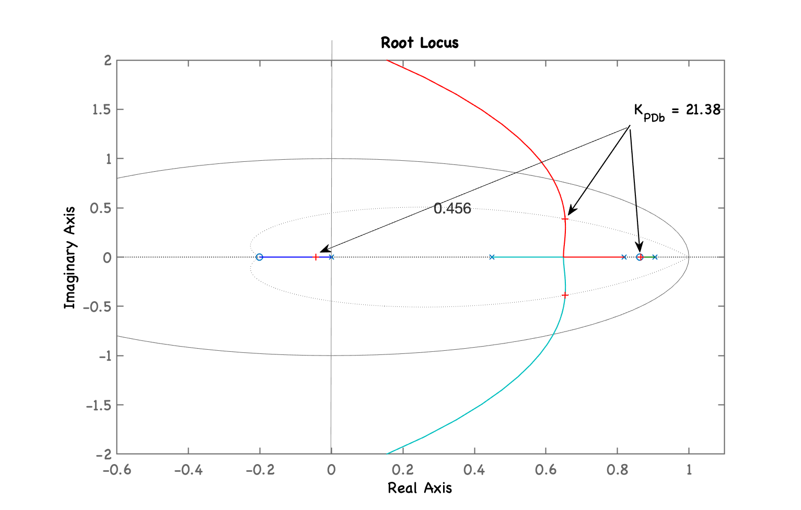

Temos o seguinte RL com "zoom" sobre região de interesse e ressaltando ganho adotado:

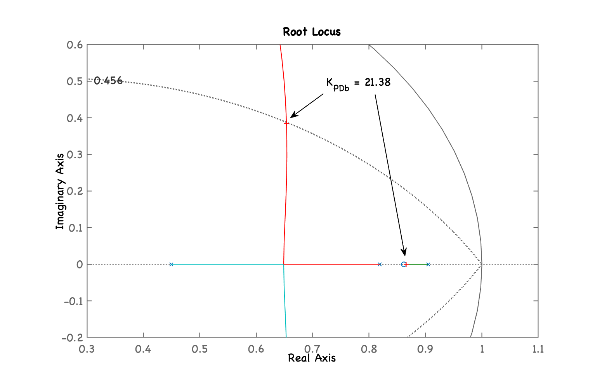

Fechando a malha:

```matlab
>> ftmf_PDb=feedback(K_PDb*ftma_PDb, 1);
>> figure; step(ftmf_PDb)
```

E temos a seguinte resposta ao degrau:

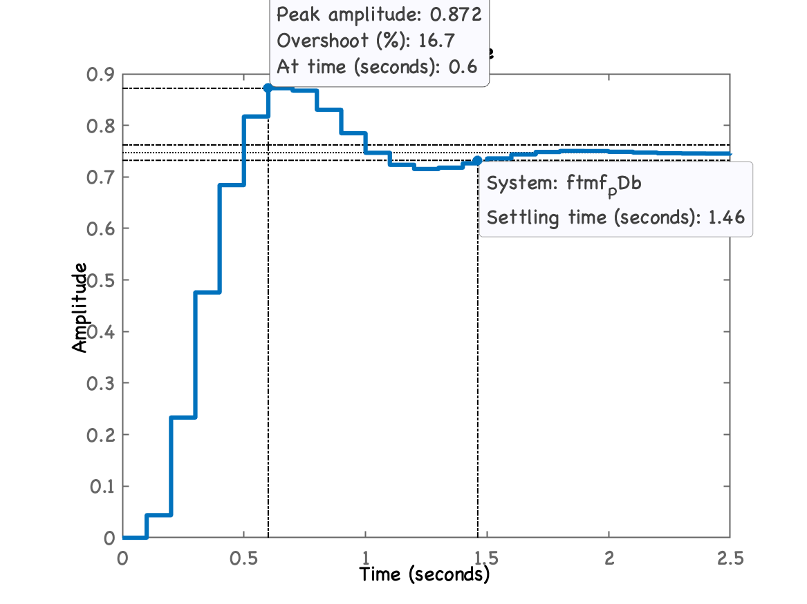

Comparando com outros controladores

```matlab
>> figure; step(ftmf_K_OS2, ftmf_PId, ftmf_PDb)
>> legend('Prop', 'PId', 'PDb')
```

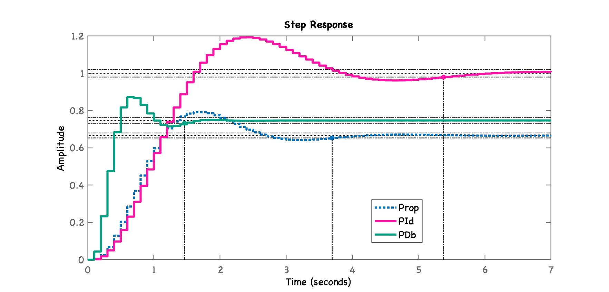

### Projeto do PD "d"

Realizando o projeto do PD opção "d". Neste caso, analizando os RL's para as outras opções, percebemos uma 4a-opção: "d", neste caso, colocamos o zero do PD propositalmente sobre o pólo + lento da planta (provacando deliberadamente um cancelamento pólo-zero).

```matlab
>> polos_BoG=pole(BoG)
polos_BoG =
      0.90484
      0.81873
      0.44933
>> C_PDd=tf(poly(polos_BoG(1)),[1 0],T)

C_PDd =
 
  z - 0.9048
  ----------
      z
 
Sample time: 0.1 seconds
Discrete-time transfer function.

>> ftma_PDd=C_PDd*BoG;
>> figure; rlocus(ftma_PDd)
>> hold on; zgrid(zeta,0)
>> axis([0.3 1.1 -0.2 0.6])
>> [K_PDd,polosMF]=rlocfind(ftma_PDd)
Select a point in the graphics window
selected_point =
      0.63369 +    0.39825i
K_PDd =
       21.641
polosMF =
      0.90484 +          0i
      0.63466 +    0.39828i
      0.63466 -    0.39828i
    -0.045501 +          0i
```

Temos o RL com o mesmo "zoom" sobre região de interesse e ressaltando ganho adotado:

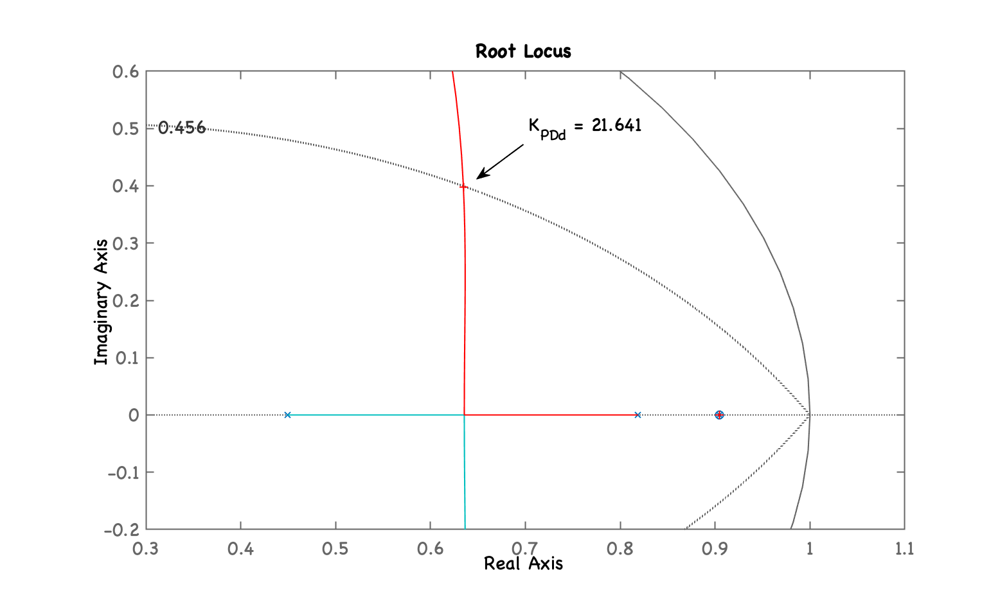

Fechando a malha...

```matlab
>> ftmf_PDd=feedback(K_PDd*ftma_PDd, 1);
>> figure; step(ftmf_PDb, ftmf_PDd)
>> legend('PD(b)', 'PD(d)')
```

Resposta à entrada degrau deste PD:

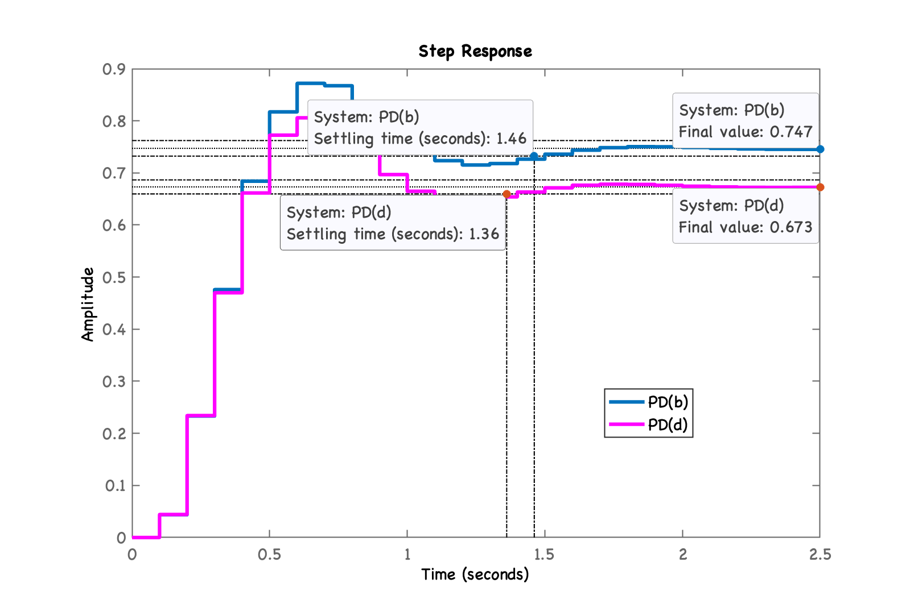

```matlab
>> stepinfo(ftmf_PDd)

        RiseTime: 0.2
    SettlingTime: 1.4
     SettlingMin: 0.64747
     SettlingMax: 0.80581
       Overshoot: 19.709
      Undershoot: 0
            Peak: 0.80581
        PeakTime: 0.6
```

O PD "d" é mais rápido que o PD "b", mas o erro é maior:

```matlab
>> erro_PDb=((1-dcgain(ftmf_PDb))/1)*100
erro_PDb =
       25.279
>> erro_PDd=((1-dcgain(ftmf_PDd))/1)*100
erro_PDd =
       32.686
```

## Controlador Lead

Neste caso o pólo do controlador se afasta da ligeiramente da origem do plano-z. No caso desta planta sua posição deve ficar abaixo de $z=0,4493$ (pólo mais rápido da planta).

Lembrando da eq. do PD "b":

```matlab
>> zpk(C_PDb)
 
  (z-0.8618)
  ----------
      z
 
Sample time: 0.1 seconds
Discrete-time zero/pole/gain model.
```

Usando a mesma posição do zero do PD "b" para o Lead:

```matlab
>> C_Lead=tf(poly(0.8618),[1 -0.2],T)

C_Lead =
 
  z - 0.8618
  ----------
   z - 0.2
 
Sample time: 0.1 seconds
Discrete-time transfer function.

>> ftma_Lead=C_Lead*BoG;
>> figure; rlocus(ftma_Lead)
>> hold on; zgrid(zeta,0)
>> axis([0.3 1.1 -0.2 0.6])
>> [K_Lead,polosMF]=rlocfind(ftma_Lead)
Select a point in the graphics window
selected_point =
      0.69005 +    0.36477i
K_Lead =
       15.397
polosMF =
      0.86586 +          0i
      0.68946 +    0.36481i
      0.68946 -    0.36481i
     0.096638 +          0i
```

Obtemos o seguinte RL:

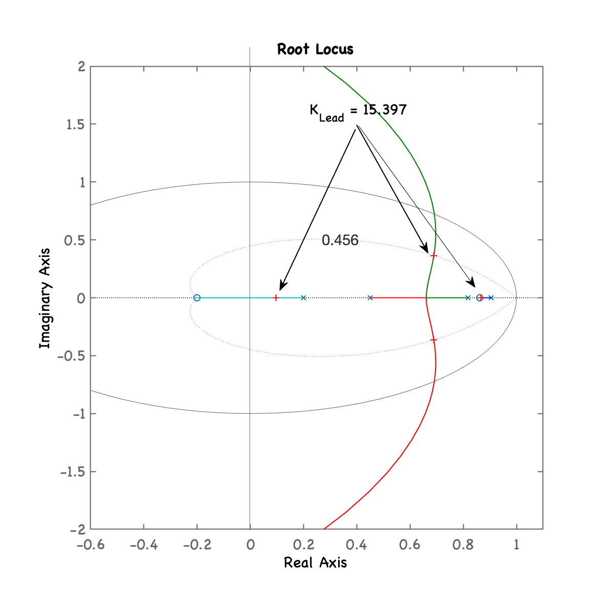

Repare que o pólo deste controlador está afastado da origem do plano-z.

O mesmo RL com zoom na região de interesse e mostrando ganho adotado:

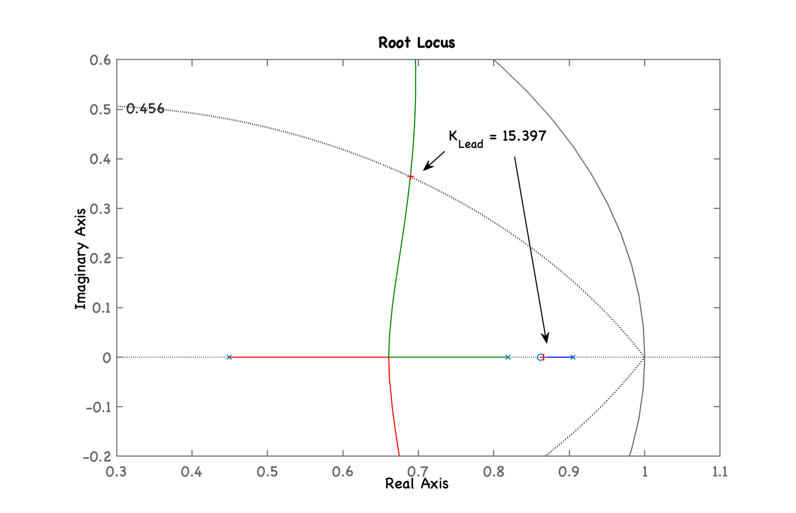

Fechando a malha...

```matlab
>> ftmf_Lead=feedback(K_Lead*ftma_Lead, 1);
>> figure; step(ftmf_Lead, ftmf_PDb)
>> legend('Lead', 'PD (b)')
```

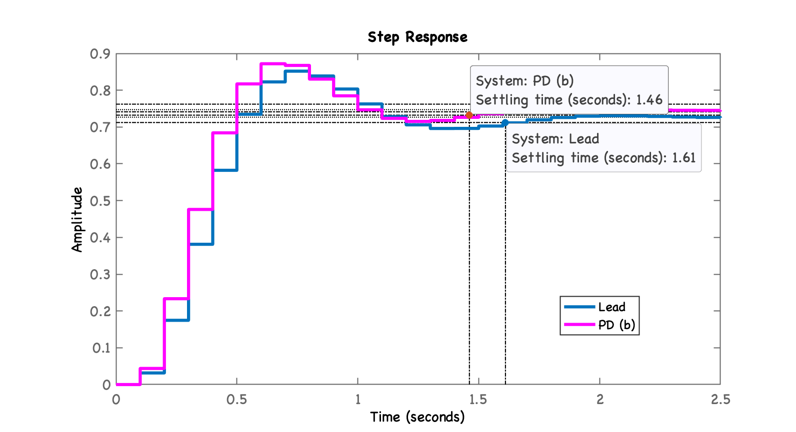

Calculando o erro de regime permanente

```matlab
>> dcgain(ftmf_Lead)
ans =
      0.72677
>> erro_Lead=((1-dcgain(ftmf_Lead))/1)*100
erro_Lead =
       27.323
```

---

Terminando esta seção de trabalho:

```matlab
>> save planta
>> diary off
>> quit
```

---

<script language="JavaScript">
<!-- Hide JavaScript...
var LastUpdated = document.lastModified;
document.writeln ("Fernando Passold, em " + LastUpdated); // End Hiding -->
</script>
