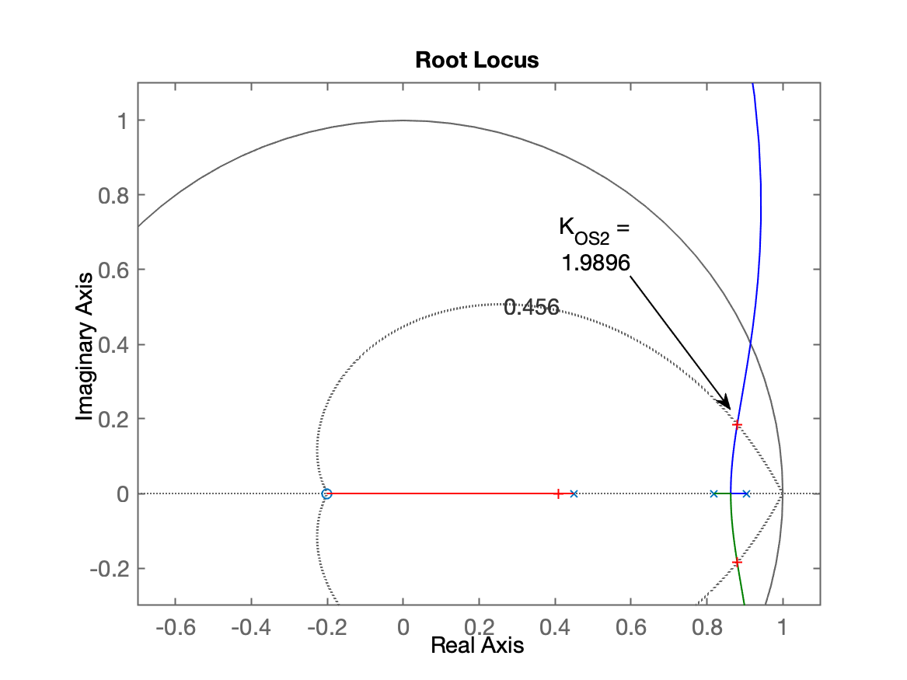
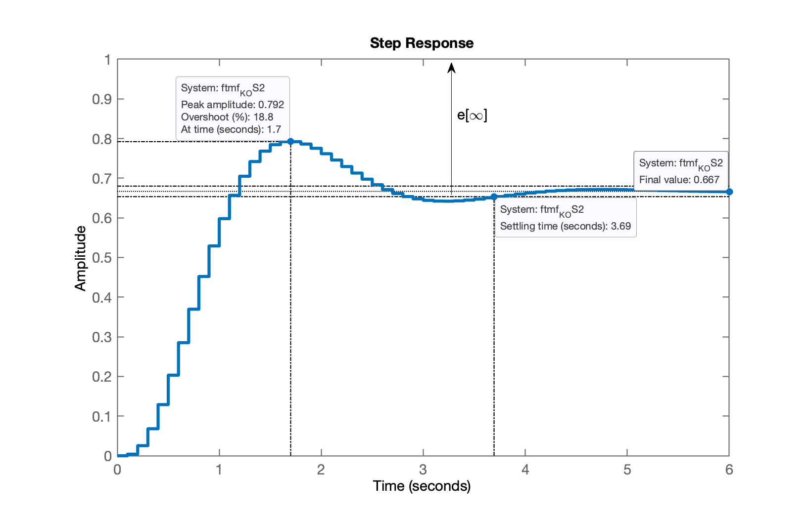
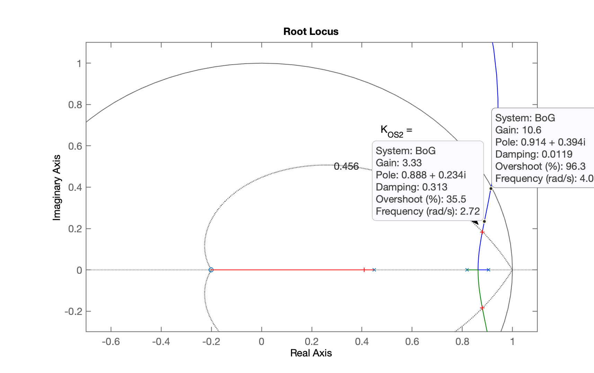
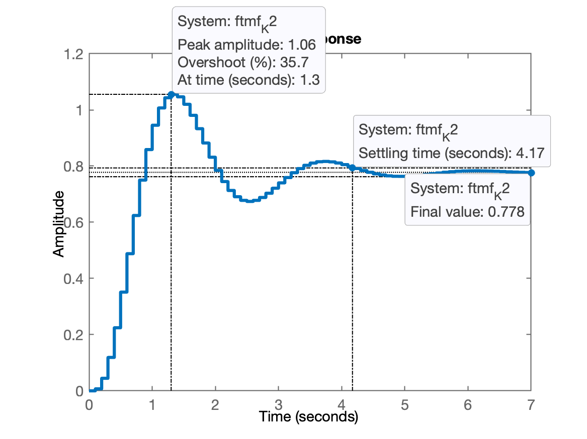
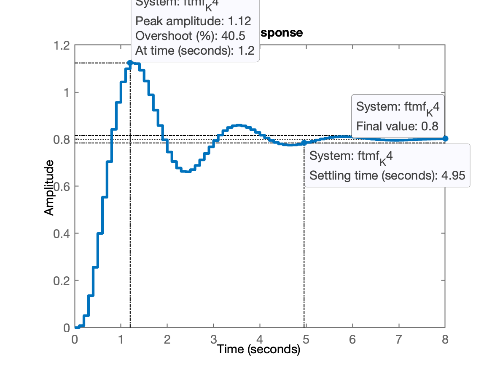
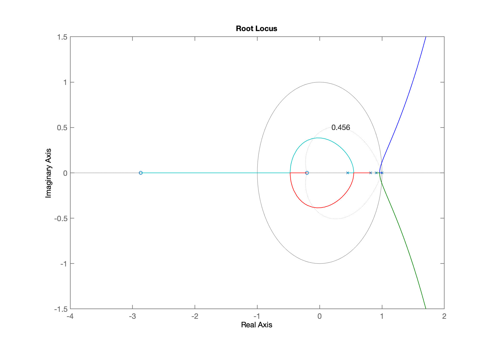
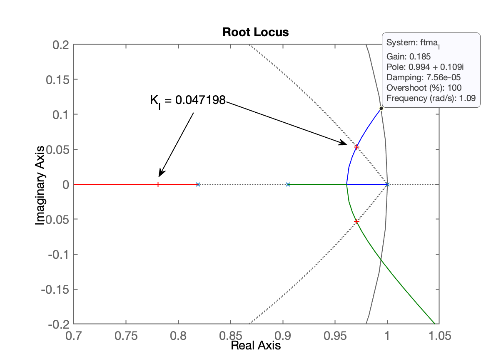
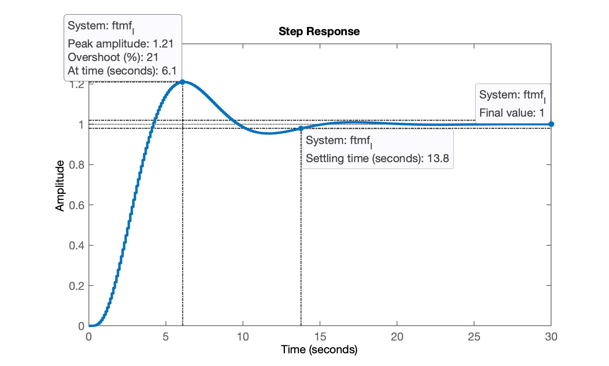
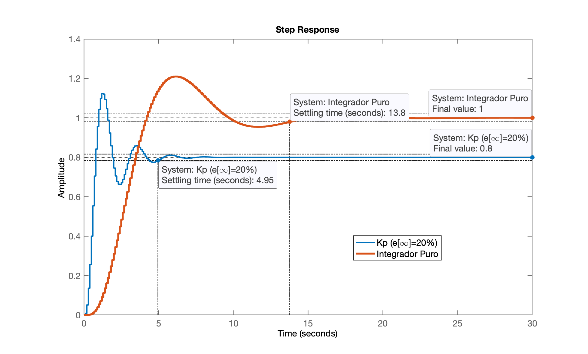

# Projeto de Controladores Digitais

[:musical_note:](https://youtu.be/OMy8lKG6Atc?si=r4wXn4xQyRW_PiU1) Aula de 22/04/2024.

Iniciando da seção anterior [Aula de 08/04/2024](aula_080402024.html) (arquivo [planta.mat](planta.mat)) :rocket::

```matlab
>> diary aula_22042024.txt		% iniciando novo registro
>> load planta					% carregando dados da aula passada
>> zpk(BoG)						% verificando dados da planta

ans =
 
   0.0020446 (z+2.867) (z+0.2013)
  --------------------------------
  (z-0.9048) (z-0.8187) (z-0.4493)
 
Sample time: 0.1 seconds
Discrete-time zero/pole/gain model.

>> 
```

## Controlador Proporcional - Projeto 4

Suponha que os requisitos de controle sejam:

* $\%OS \le 20\%$ (*overshoot* ou sobresinal máximo);
* $e(\infty) \le 20\%$ (errro de regime permanente).

Realizando o projeto no Matlab:

```matlab
>> OS=20;
>> zeta=(-log(OS/100))/(sqrt(pi^2+(log(OS/100)^2)))
zeta =
      0.45595
>> close all % fechar todas as figuras
>> rlocus(BoG)
>> hold on;
>> zgrid(zeta,0)
>> % fazendo zoom na região de interesse
>> axis([-0.7 1.1 -0.3 1.1])
>> % sintonizando o controlador
>> [K_OS2,polosMF]=rlocfind(BoG)
Select a point in the graphics window
selected_point =
      0.88033 +    0.18328i
K_OS2 =
       1.9896
polosMF =
       0.8798 +    0.18337i
       0.8798 -    0.18337i
      0.40923 +          0i
>> 
```

Obtemos o seguinte *root-loucs* já ressaltando o ganho encontrado usando comando `rlocfind()`:



Fechando a malha com um ganho ligeiramente superior...

```matlab
>> K_OS2=2;
>> ftmf_K_OS2=feedback(K_OS2*BoG,1);
>> pole(ftmf_K_OS2)
ans =
      0.87987 +    0.18383i
      0.87987 -    0.18383i
      0.40906 +          0i
>> figure; step(ftmf_K_OS2)
```

E temos a figura que mostra a resposta para entrada degrau:



E percebemos alguns detalhes:

* Valor de pico da saída do sistema, $Max\{y[k]\}=$ 0,792; no tempo $t_p=$ 1,7 segundos; ($\%OS=$ 18,8% em relação ao valor atingido em regime permanente pela planta, $y[\infty]=$ 0,667);
* Valor em regime permanente atingido pela planta, $y[\infty]=$ 0,667. Note que a referência era uma entrada degrau, o que significa que o desejado era $y[\infty] \to 1,0$.

Notamos um erro de regime permanente, $e[\infty]$:

```matlab
>> dcgain(ftmf_K_OS2)
ans =
      0.66667
>> erro=((1-dcgain(ftmf_K_OS2))/1)*100
erro =
       33.333
```

Algumas conclusões:

* O erro está acima do desejado (que era $\le$ 20%);
* Podemos aumentar o ganho porque $Max\{y[k]\}=$0,792 e poderia ter alcançado o valor 1,2 (20% de 1,0 do degrau unitário).

Aumentando o ganho "manualmente"... para tanto vamos observar o root-locus:



```matlab
>> K_2=3.5;
>> ftmf_K2=feedback(K_2*BoG,1);
>> figure; step(ftmf_K2)
```

Percebemos que com este ganho:



Aumentando o ganho ocorreu:

* $Max\{ y[k] \}=$ 1,06 (lembrando que poderia ter alcançado 1,2) $\rightarrow$ $\%OS=6\%$;
* o erro baixou, pois $y[\infty]=$ 0,778, ou seja:

```matlab
>> dcgain(ftmf_K2)
ans =
      0.77778
>> erro=((1-dcgain(ftmf_K2))/1)*100
erro =
       22.222
```

### Determinando o valor do ganho de maneira mais determinística

Usando a **[Teoria do erro](https://fpassold.github.io/Controle_3/4_teoria_erros/resumo_teoria_erro.html)** para determinar que valor de ganho deveria usar para manter $e[\infty] \le$ 20%.

O cálculo do erro é determinado por:

$e_{Step}(\infty)=\dfrac{1}{1+K_p}$		(eq. (1))

onde: $K_p=$ constante (de erro estático) de posição:

$K_p = \displaystyle\lim_{z \to 1} FTMA(z)$.

Calculando o $K_p$ necessário para este caso: $e[\infty]=20\%$. Note: $e[\infty]=20\%=0,2$. Então substituindo o valor do erro na eq. (1) encontramos o valor necessário para $K_p$:

$0,2=\dfrac{1}{1+K_p}$

$0,2(1+K_p)=1$

$0,2 K_p = 1 - 0,2$

$K_p=\dfrac{1-0,2}{0,2}$

```matlab
>> Kp=(1-0.2)/0.2
Kp =
     4
```

Necessitamos calcular o $\displaystyle\lim_{z \to 1} FTMA(z)$:

$\displaystyle\lim_{z \to 1} FTMA(z) =\displaystyle\lim_{z \to 1} K \cdot BoG(z) =  \displaystyle\lim_{z \to 1} K \left[ \dfrac{0.0020446 (z+2.867) (z+0.2013)}{(z-0.9048) (z-0.8187) (z-0.4493)} \right]$

$\displaystyle\lim_{z \to 1} FTMA(z)=K \left[ \dfrac{0.0020446 (1+2.867) (1+0.2013)}{(1-0.9048) (1-0.8187) (1-0.4493)} \right]$

No Matlab, podemos usar a função `dcgain()` para determinar o limite $\displaystyle\lim_{z  \to 1} FTMA(z)$:

```matlab
>> limite=dcgain(BoG)
limite =
            1
```

Então temos:

$e_{Step}[\infty]=\dfrac{1}{1+K_p}$

$K_p = \displaystyle\lim_{z \to 1} FTMA(z)$ 

$K_p = K \cdot \underbrace{\displaystyle\lim_{z \to 1} BoG(z)}_{=1}$

$K_p=K \cdot 1$

dai concluímos que:

$K=K_p=4$.

Fechando a malha com $K=4$:

```matlab
>> K4=Kp
K4 =
     4
>> ftmf_K4=feedback(K4*BoG,1);
>> figure; step(ftmf_K4)
```

O que rende a seguinte resposta:



E notamos que atendemos aos requisitos de controle desejados.

----

Notamos que apenas com controle proporcional numa planta tipo 0, não conseguimos garantir erro nulo para regime permanente. Se fez necessário incoporar ação integral à equação de malha direta do sistema.

## Controle com Pura Ação Integral

Lembrando da [teoria do erro](https://fpassold.github.io/Controle_3/4_teoria_erros/resumo_teoria_erro.html), a ação integral se caracteriza por um pólo em $z=1$. Então a equação de um controlador com ação integral pura fica:

$C_I(z)=K_i \cdot \left( \dfrac{1}{z-1} \right)$

onde $K_i$ corresponde ao ganho adotado para o controlador.

Realizando o projeto usando Matlab:

```matlab
>> C_I=tf(1,[1 -1], T)

C_I =
 
    1
  -----
  z - 1
 
Sample time: 0.1 seconds
Discrete-time transfer function.

>> ftma_I = C_I*BoG;
>> zpk(ftma_I)

ans =
 
      0.0020446 (z+2.867) (z+0.2013)
  --------------------------------------
  (z-1) (z-0.9048) (z-0.8187) (z-0.4493)
 
Sample time: 0.1 seconds
Discrete-time zero/pole/gain model.

>> rlocus(ftma_I)
>> axis equal
>> % realizando um zoom na região de interesse
>> axis([-4 2 -1.5 1.5])
```

O RL para este sistema (de 4a-ordem) fica:



Realizando um zoom na área de interesse e acrescentando a linha guia para mesmos valores de $\zeta$ correspondendo ao $\%OS=$ 20%:

```matlab
>> hold on;
>> zgrid(zeta,0)
>> axis([0.7 1.05 -0.2 0.2])
>> [K_I,polosMF]=rlocfind(ftma_I)
Select a point in the graphics window
selected_point =
      0.97085 +   0.053215i
K_I =
     0.047198
polosMF =
      0.97039 +   0.053366i
      0.97039 -   0.053366i
      0.78049 +          0i
      0.45162 +          0i
```

Teremos um RL ressaltando este valores de ganho como o mostrado na próxima figura:



Fechando a malha com $K=0,05$ (note que é um valor muito baixo; impraticável provavelmente):

```matlab
>> K_I=0.05;
>> ftmf_I=feedback(K_I*ftma_I,1);
>> pole(ftmf_I)
ans =
      0.97111 +   0.055534i
      0.97111 -   0.055534i
      0.77891 +          0i
      0.45176 +          0i
>> figure; step(ftmf_I)
```

E obtemos a seguinte resposta à entrada degrau:



Repare que o erro de regime permanente agora é nulo. E perceba o $\%OS=$ 21%.

**Mas...** comparando a resposta deste controlador com o anterior (simples ganho Proporcional):

```matlab
>> figure; step(ftmf_K4, ftmf_I);
>> legend('Kp (e[\infty]=20%)', 'Integrador Puro')
```

Obtemos então:



Percebo que o controlador com ação inregral pura permitiu zerar o erro de regime permanente, **mas** aumentou consideravelmente o tempo de assentamento, $t_s$ (de 4,95 passamos para 12,8 segundos), atrasando a resposta do sistema quase 3 vezes ($13.8/4.95 =  2.7879$).

Fim...

Não esquecer de encerrar a seção de trabalho no Matlab fazendo:

```Matlab
>> save planta		% salva dados para continuação na próxima aula
>> diary off		% encerra arquivo texto de registro dos comandos usados
```

Arquivo de dados atualizado: [planta.mat](planta.mat).

----

Fernando Passold, em 22/04/2024.

