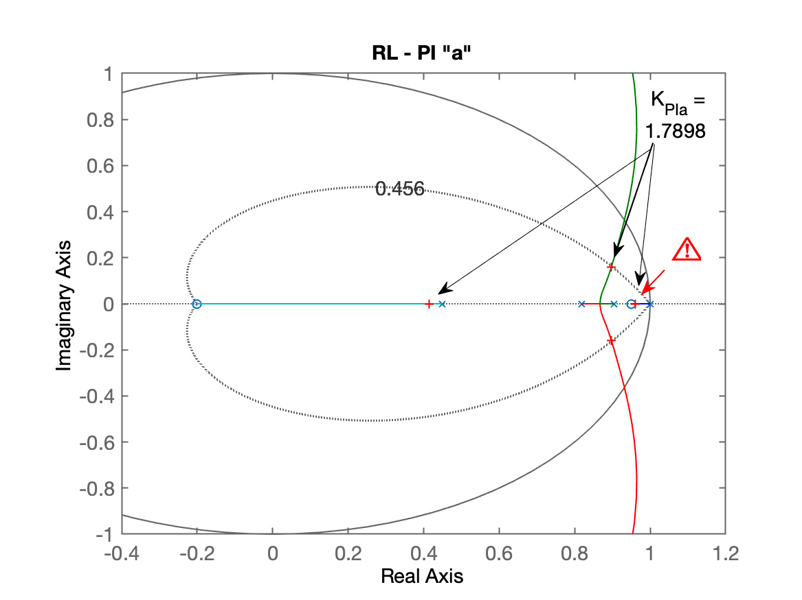
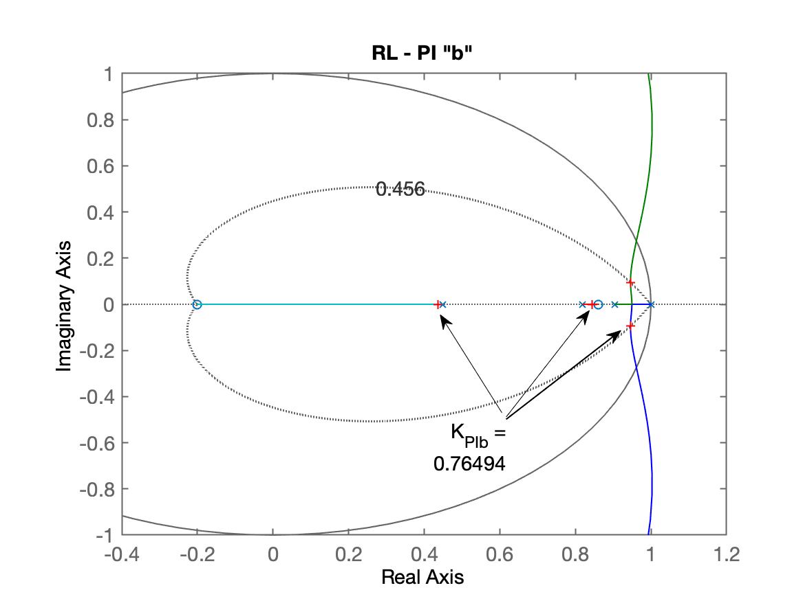
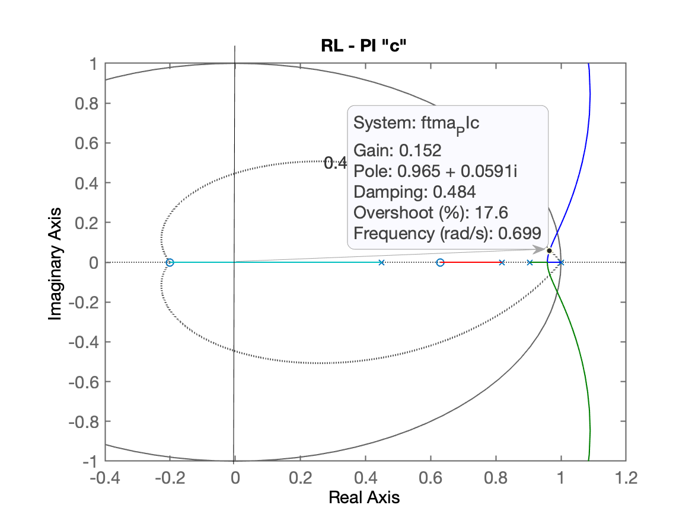
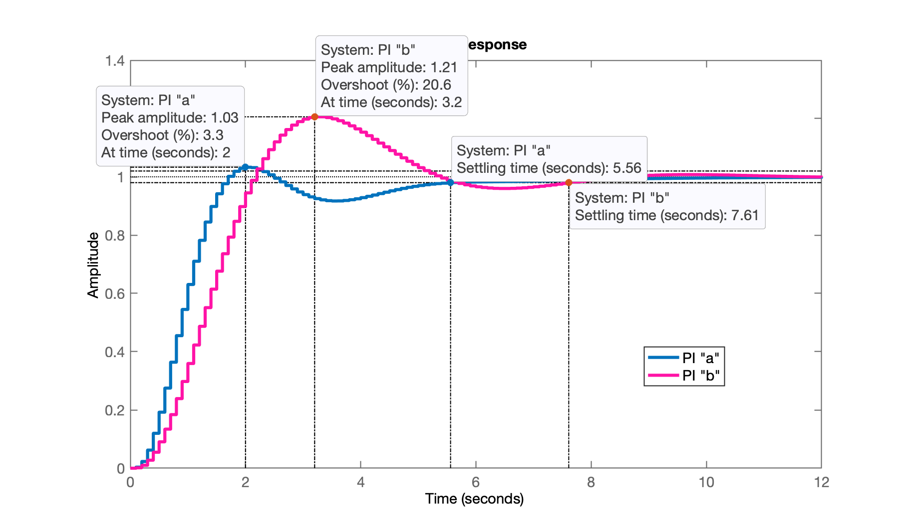
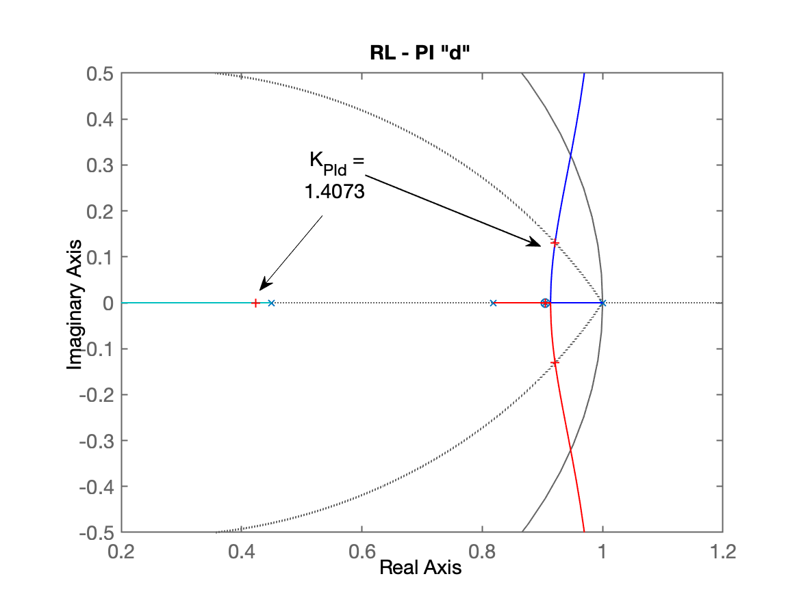
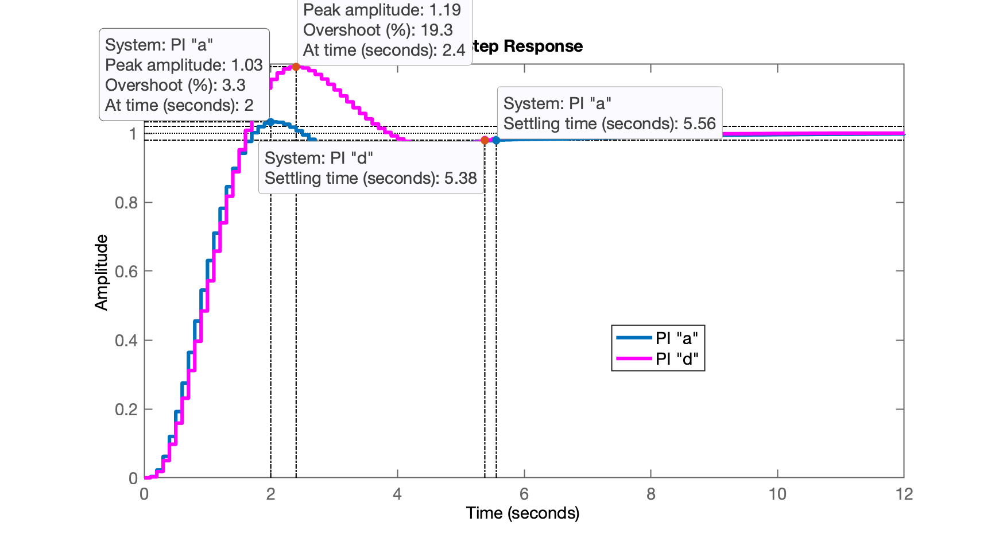
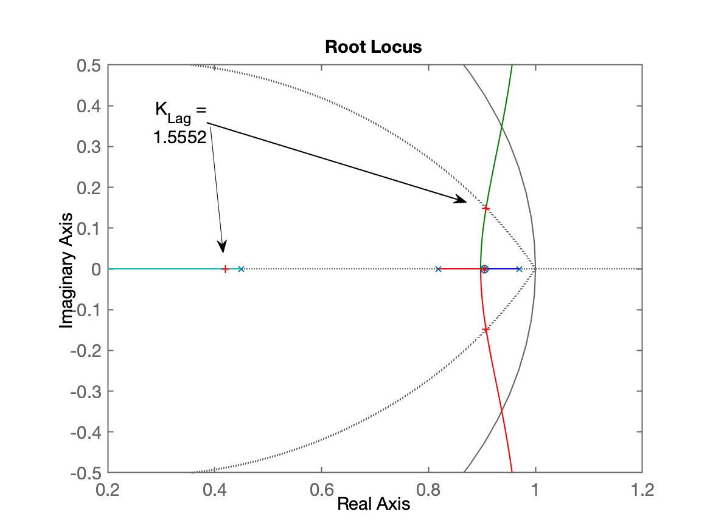
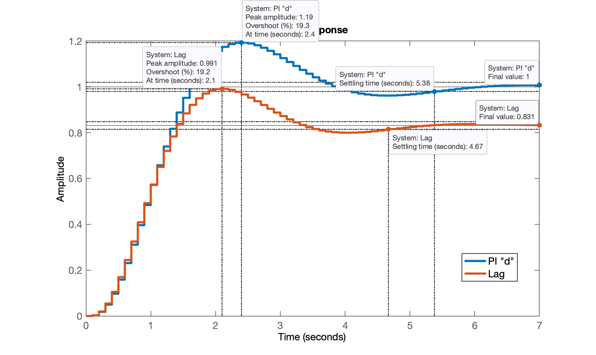

# Projeto Controladores

Aula de 29/04/2024

Continuando da aula anterior [22/04/2024](/aula_22042024.html), arquivo [planta.mat](planta.mat):

```matlab
>> diary aula_29042024.txt
>> load planta.mat
```

## Projeto de PI

**Base teórica**:

Controlador PI = Proporcional + Integral:


$C_{PI}(z)=K_p+\dfrac{K_i}{z-1}=\dfrac{K_p(z-1)+K_i}{z-1}=\dfrac{K_pz-Kp+K_i}{(z-1)}$

$C_PI(z)=\dfrac{K_p\left( z - \frac{K_p}{K_p} + \frac{K_i}{K_p}\right)}{(z-1)}=\dfrac{K_p \left[ z - \left( 1 - \dfrac{K_i}{K_p}\right)\right]}{(z-1)}$

ou simplesmente:s

$C_{PI}(z)=\dfrac{K(z-z_{PI})}{z-1}$

onde temos o zero do PI, em $z_{PI}=\left( 1-\dfrac{K_i}{K_p}\right)$ e o pólo em $z=1$ (como esperado para a ação integral).

**Projeto**:

Incognitas: $K$ (ganho do PI, determinado via *Root-Locus*) e o zero do PI: $z_{PI}$.

Opções para o $z_{PI}$: varia conforme a planta à qual vai ser aplicado. Os valores à seguir possúem relação com os pólos da planta, $BoG(z)$:

$BoG(s)=\dfrac{0.0020446 (z+2.867) (z+0.2013)}{(z-0.9048) (z-0.8187) (z-0.4493)}$

O zero do PI vai estar intercalando posições entre seu integrador em $z=1$ e os pólos da planta, até a origem do plano-z.

Opções para localizaçao do zero do PI:


ou:

* Opção a) $0,9048 < z_{PI}< 1$ (entre o pólo + lento da planta e o integrador);
* Opção b) $0,8187 < z_{PI} < 0,9048$; (entre os 2 pólos + lentos da planta);
* Opção c) $0,8187 < z_{PI} < 0,4493$ (entre os 2 pólos não tão lentos da planta).

Avaliando estes casos com ajuda do Matlab. Note que para cada nova posição, o RL se modifica.

```matlab
>> % Ingressando os controladores (as 3 opções)
>> C_PIa=tf([1 -0.95],[1 -1],T)

C_PIa =
 
  z - 0.95
  --------
   z - 1
 
Sample time: 0.1 seconds
Discrete-time transfer function.

>> C_PIb=tf([1 -0.86],[1 -1],T)

C_PIb =
 
  z - 0.86
  --------
   z - 1
 
Sample time: 0.1 seconds
Discrete-time transfer function.

>> C_PIc=tf([1 -0.63],[1 -1],T)

C_PIc =
 
  z - 0.63
  --------
   z - 1
 
Sample time: 0.1 seconds
Discrete-time transfer function.

>> % Determinando a FTMA(z) para cada caso:
>> ftma_PIa=C_PIa*BoG;
>> ftma_PIb=C_PIb*BoG;
>> ftma_PIc=C_PIc*BoG;
>> % Desenhando os RL's
>> figure; rlocus(ftma_PIa);
>> axis([-0.4 1.2 -1 1])
>> hold on; zgrid(zeta,0)
>> title('RL - PI "a"')
```

RL para o PI opção "a":



Continuando com o RL para o PI "b":

```matlab
>> figure; rlocus(ftma_PIb);
>> axis([-0.4 1.2 -1 1])
>> hold on; zgrid(zeta,0)
title('RL - PI "b"')
```

Segue o RL para o PI opção "b":



E Falta o RL para o PI "c":

```matlab
>> figure; rlocus(ftma_PIc);
>> axis([-0.4 1.2 -1 1])
>> hold on; zgrid(zeta,0)
title('RL - PI "c"')
```

Segue RL do PI opção "c":



Comparando visualmente os 3 RL´s, percebe-se que apenas as opções "a" e "b" parecem mais promissoras, isto é, com pólos dominantes mais distantes do círculo unitário. 

> Lembrar que o módulo de um número complexo: $p=\sigma+j\omega$ rende: $p=r \angle \theta$, onde $r=\sqrt{\sigma^2+\omega^2}$ e $\theta=\tan^{-1}(\omega/\sigma)$; $r$ corresponde uma "reta" que parte da origem do plano$-z$ e alcaça o pólo e $\theta$ corresponde ao ângulo do pólo; o tempo de resposta, $t_s$ (ou de assentamento) de um pólo é diretamente proporcional à esta distânica $r$, o que significa que quanto mais próximo o pólo se encontrar do círculo unitário, mais lenta será a resposta do sistema em MF associada com este pólo. No Matlab o módulo de um número complexo, o $r$, pode ser calculando através da função `abs(<polo>)` e o ângulo $\theta$ pode ser calculado via função `angle(<polo>)`(recordar que o ângulo resulta em radianos).

Continuando no Matlab, sintonizando os controladores PI "a" e PI "b":

```matlab
>> % fechando para o PI a
>> [K_PIa,polosMF]=rlocfind(ftma_PIa)
Select a point in the graphics window
selected_point =
        0.891 +    0.16099i
K_PIa =
       1.7898
polosMF =
      0.95978 +          0i
      0.89719 +     0.1599i
      0.89719 -     0.1599i
      0.41508 +          0i
>> 
>> % Sintonizando o PI b
>> [K_PIb,polosMF]=rlocfind(ftma_PIb)
Select a point in the graphics window
selected_point =
      0.94408 +   0.092879i
K_PIb =
      0.76494
polosMF =
      0.94572 +   0.092902i
      0.94572 -   0.092902i
      0.84431 +          0i
      0.43557 +          0i
```

Fechando as malhas:

```matlab
>> ftmf_PIa=feedback(K_PIa*ftma_PIa,1)
>> ftmf_PIb=feedback(K_PIb*ftma_PIb,1);
>> figure; step(ftmf_PIa, ftmf_PIb)
>> legend('PI "a"', 'PI "b"')
```

Resposta ao degrau para os 2 PI's:



**Testando a opção "d"**:

* Opção d) Deliberadamente colocamos o zero do PI sobre o pólo mais lento da planta. Propositalmente para provocar um "**cancelamento pólo-zero**", o que neste caso, vai ainda implicar em "**redução na complexidade do sistema**", ou seja, de 4a-ordem, o sistema vai passar para 3a-ordem.

$BoG(z)=\dfrac{0.0020446 (z+2.867) (z+0.2013)}{(z-0.9048) (z-0.8187) (z-0.4493)}$

então neste caso:

$C_{Pid}(z)=\dfrac{K(z-0.9048)}{z-1}$

desta forma a $FTMA(z)$ fica:

$FTMA(z)=\dfrac{0.0020446 K \cancel{(z-0.9048)}(z+2.867)(z+0.2013)}{(z-1)\cancel{(z-0.9048)} (z-0.8187) (z-0.4493)}$

No Matlab:

```matlab
>> polos_BoG=pole(BoG)
polos_BoG =
      0.90484
      0.81873
      0.44933
>> C_PId=tf([1 -polos_BoG(1)],[1 -1],T)

C_PId =
 
  z - 0.9048
  ----------
    z - 1
 
Sample time: 0.1 seconds
Discrete-time transfer function.
>> ftma_PId=C_PId*BoG;
>> zpk(ftma_PId)
 
  0.0020446 (z+2.867) (z-0.9048) (z+0.2013)
  -----------------------------------------
   (z-1) (z-0.9048) (z-0.8187) (z-0.4493)
 
Sample time: 0.1 seconds
Discrete-time zero/pole/gain model.

>> zpk(minreal(ftma_PId))   % usando minreal para mostrar cancelamento:
 
  0.0020446 (z+2.867) (z+0.2013)
  ------------------------------
   (z-1) (z-0.8187) (z-0.4493)
 
Sample time: 0.1 seconds
Discrete-time zero/pole/gain model.

>> figure; rlocus(ftma_PId)
>> axis([0.2 1.2 -0.5 0.5])
>> hold on; zgrid(zeta,0)
>> [K_PId,polosMF]=rlocfind(ftma_PId)
Select a point in the graphics window
selected_point =
      0.92156 +    0.13003i
K_PId =
       1.4073
polosMF =
       0.9209 +     0.1301i
       0.9209 -     0.1301i
      0.90484 +          0i
      0.42338 +          0i
>> title('RL - PI "d"')
```

O RL deste controlador mostrando o ganho adotado aparece à seguir:



Fechando a malha e verificando a resposta ao degrau...

```matlab
>> ftmf_PId=feedback(K_PId*ftma_PId,1)
>> figure; step(ftmf_PIa, ftmf_PId)
>> legend('PI "a"', 'PI "d"')
```

E temos as seguintes respostas:



Fim... para controladores com ação integral "pura".

---

## Controlador por Atraso de Fase ("Lag")

Este controlador é similar ao PI com a diferença de que seu pólo não está exatamente em $z=1$, isto significa que deixa de ser um intregrador. E se deixa de existir um integrador na $FTMA(z)$ de um sistema tipo 0 (que o caso da planta usada aqui), significa que vamos passar a ter erro em regime permanente, ou $e_{\text{Step}}[\infty] \neq 0$.

O último controlador:

$C_{PId}(z)=\dfrac{1.4073(z-0.9048)}{(z-1)}$

Podemos projetar um "Lag" similar ao último PI:

$C_{Lag}=\dfrac{K(z-0,9048)}{(z-0,97)}$

No Matlab:

```matlab
>> C_Lag=tf([1 -polos_BoG(1)],[1 -0.97],T)

C_Lag =
 
  z - 0.9048
  ----------
   z - 0.97
 
Sample time: 0.1 seconds
Discrete-time transfer function.

>> ftma_Lag=C_Lag*BoG;
>> zpk(ftma_Lag)
 
  0.0020446 (z+2.867) (z-0.9048) (z+0.2013)
  -----------------------------------------
  (z-0.97) (z-0.9048) (z-0.8187) (z-0.4493)
 
Sample time: 0.1 seconds
Discrete-time zero/pole/gain model.

>> figure; rlocus(ftma_Lag)
>> axis([0.2 1.2 -0.5 0.5])
>> hold on; zgrid(zeta,0)
>> [K_Lag,polosMF]=rlocfind(ftma_Lag)
Select a point in the graphics window
selected_point =
      0.90735 +    0.14861i
K_Lag =
       1.5552
polosMF =
      0.90756 +    0.14858i
      0.90756 -    0.14858i
      0.90484 +          0i
      0.41976 +          0i
```

RL do Lag com ganho adotado:



Fechando a malha e verificando a resposta ao degrau:

```matlab
>> ftmf_Lag=feedback(K_Lag*ftma_Lag,1);
>> figure; step(ftmf_PId, ftmf_Lag)
```



Notamos que agora existe um erro em regime permanente:

```matlab
>> dcgain(ftmf_Lag)
ans =
      0.83146
>> erro_Lag=((1-dcgain(ftmf_Lag))/1)*100
erro_Lag =
       16.854
```

Fim.

E com isto encerramos os trabalhos por hoje:

```matlab
>> save planta
>> diary off
>> quit
```

Arquivo de dados: [planta.mat](planta.mat).

Próxima aula: Controladores com Ação Derivativa.

---

Fernando Passold, em 29/04/2024.

