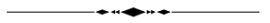

# Processamento de Sinais e Controle Digital

* Parte de **[Laboratório](lab/lab_proces_ecp_2024.html)** 𓀨 🖥️ !?

* [Embaseamento teórico](#teoria) (transformada-Z).
* [Parte I: **Cotrole Digital**](#parte1)
* [Parte II: **Processamento Digital de Sinais**](#parte2).
* [Método de Avaliação](#aval)
* [Software usado](#soft)
* [Detalhes da disciplina](#detalhes)

---

👇 Segue Parte Teórica

## Embasamento Teórico Inicial

1. [Teoria da amostragem e Aquisição de Sinais](../Controle_3/2_sampling/01_Sistema_Amostrado_no_Tempo.pdf). :beginner:
   1. [Simulação demonstrando Teorema da Amostragem](https://fpassold.github.io/Controle_3/Teste_Amost/teste_amostragem.html) (*Amostrando uma onda dente-de-serra*).
   2. [Síntese de Onda Quadrada usando Série de Fourier](https://fpassold.github.io/Controle_3/estudo_dirigido/Síntese_Onda_Quadrada.html). 
   3. [Wolfram Demonstrations Project: **Sampling Theorem**](https://demonstrations.wolfram.com/SamplingTheorem/)
   4. [Wolfram Demonstrations Project: **Aliasing** in Time Series Analysis](https://demonstrations.wolfram.com/AliasingInTimeSeriesAnalysis/);
2. Transformada Z.
   1. Parte 1:  [transformada_Z.pdf](../Controle_3/3_transformada/transformada_Z.pdf) (parte inicial, definições, transformadas de sinais "básicos")
   2. Parte 2:  [transformada_Z_parte2.pdf](../Controle_3/3_transformada/transformada_Z_parte2.pdf) (continuando com transformadas de outros sinais, Propriedades)
   3. Parte 3:  [transformada_Z_parte_3.pdf](../Controle_3/3_transformada/transformada_Z_parte_3.pdf) (Métodos Transformada Inversa de Laplace)
   4. Resumo:  [revisao_partes_importantes_transformada_Z.pdf](../Controle_3/3_transformada/revisao_partes_importantes_transformada_Z.pdf) (paralelos sinais/sistemas tempo contínuo x tempo discreto)

## Parte 1: **Controle Digital**:

1. Modelagem do Sustentador de Ordem Zero ([cálculo de $BoG(z)$](https://fpassold.github.io/Controle_3/3_transformada/3_BoG_Transformada_Z.pdf))
2. [Impacto (ou falta) do $BoG(z)$](https://fpassold.github.io/Controle_3/3_5_Modelagem_G_BoG/teste_BoG.html)
3. [Sistema de 1a-ordem digitalizado](https://fpassold.github.io/Controle_3/exemplo_1_BoG/intro_exemplo_1a_ordem.html) (uso de Matlab)
4. Análise de Sinais/Transformada de Laplace/Modelagem (voltado à Controle Digital)
   1. [Transformada de Laplace](3_transformada_laplace.pdf) (aplicado à Controle: revisão).
   2. [Respostas temporais](4_Respostas_Sistemas.pdf) típicas de Processos Industriais.
   3. [Introdução à Modelagem](5_intro_modelagem.pdf) (algumas técnicas).
   4. [Paralelos entre plano-s $\times$ plano-z](6_respostas_paralelos_s_z.pdf) (parte final: malha controle digital típica).
5. [Introdução ao Matlab](../Matlab/aula_intro_matlab_1.html) 
6. [Ações Básicas de Controle](7_acoes_controle.pdf): P, PI, PD, PID e outros (ainda mundo contínuo).
7. [Teoria do Erro](https://fpassold.github.io/Controle_3/4_teoria_erros/resumo_teoria_erro.html) (ou da Precisão + importância do integrador c/ dedução integral numérica).
8. **Projetos de Controladores Digitais usando Root-Locus**:
   1. O que é o "Root Locus" ?
   2. Controlador Proporcional -- [Aula de 08/04/2024](2024_1/aula_080402024.html);
   3. Controlador Proporcional + Controle com Ação Integral Pura -- [Aula de 22/04/2024](2024_1/aula_22042024.html);
   4. Controlador PI (diferentes opções) + "Lag" -- [Aula de 29/04/2024](2024_1/aula_29042024.html);
   5. Teoria associada com controladores PD e Lead:
      1. [Base Teórica](https://fpassold.github.io/Controle_3/Controle_Acao_Derivativa.html);
          (video* da aula de [Processamento Sinais (Parte 1/2) (2024-05-06 19:53 GMT-3)](https://drive.google.com/open?id=1TUPkOz03XtrCgci29U_2iWQJ1XH5Kl9u));
      2. [Teste de Controladores com Ação Derivativa](https://fpassold.github.io/Controle_3/estudo_caso/Teste_Controladores_Acao_Derivativa.html) (uso de Matlab/Simulink);
          (video* da aula de [Processamento Sinais (Parte 2/2) (2024-05-06 21:01 GMT-3)](https://drive.google.com/open?id=1UbSlcx5dHV9S7n09K8VHMfBXQ8EfScXY))
      3. ["Resumo"](https://fpassold.github.io/Controle_3/pd_plus_filtro.pdf);
         *Videos eventualmente só acessíveis com usuário logado no domínio @upf.br.
   6. Controlador PD aplicado à planta do estudo de caso:
      1. [Aulas passadas](https://fpassold.github.io/Controle_3/projeto_PD_lead_2020.html);
      2. [Aula de 13/05/2024](2024_1/aula_13052024.html) (Projeto de PD e Lead).
   7. Controlador PID:
      1. [Embasamento teórico](https://fpassold.github.io/Lab_Controle_2/PID/pid.html);
      2. [Sintonizando um PID](https://fpassold.github.io/Controle_2/8_Ajuste_PID/Sintonia_PIDs_usando_ZN.html), Tabela de Ziegler-Nichols [(Wikipedia)](https://en.wikipedia.org/wiki/Ziegler–Nichols_method);
      3. Antiga [apostila](https://fpassold.github.io/Controle_3/estudo_caso/Estudo_Caso_Controladores_2020.pdf) da disciplina, ênfase em PID à partir da pág. 24 :warning:.
      4. PID no formato velocidade: [figura](https://fpassold.github.io/Controle_3/PID/uso_planta_PID_velocity.png) + arquivos: [.SLX](https://fpassold.github.io/Controle_3/PID/planta_PID_velocity.slx) ou [.MDL](https://fpassold.github.io/Controle_3/PID/planta_PID_velocity.mdl) (Simulink).

## Parte 2: **Processamento (Digital) de Sinais**:

1. [Introdução](https://fpassold.github.io/Process_Sinais/intro_process_sinal.html) à Sistemas de Processamento Digital de Sinais.

2. [Filtro de Média Móvel](https://fpassold.github.io/Process_Sinais/media_movel.html).

   1. [Uso da função `filter()` do Matlab](https://fpassold.github.io/Process_Sinais/funcao_filter.html)

3. Modelagem de um [Sistema Térmico](https://fpassold.github.io/Process_Sinais/modelo_termico.html).

4. Revisão rápida sobre [Série de Fourier](serie_fourier.html). 
   Mais info sobre Série de Fourier: [Síntese Onda Quadrada](https://fpassold.github.io/Controle_3/estudo_dirigido/Síntese_Onda_Quadrada.html),  [Wiki: Fourier Series](https://en.wikipedia.org/wiki/Fourier_series) e [Fourier Series: Graph Tool](https://www.mathsisfun.com/calculus/fourier-series.html).

5. Usando o [algoritmo de FFT para obter Espectro de um Sinal](https://fpassold.github.io/Process_Sinais/usando_fft_matlab.html).

   1. Análise de Espectro: [exemplo da Academo](https://academo.org/demos/spectrum-analyzer/).
   2. Problema: Levantar Diagrama de Espectro 
      [Espectro e reconstrução do som de uma bateria](https://fpassold.github.io/Process_Sinais/exe_uso_fft.html).

6. [Funções Transferência](https://fpassold.github.io/Process_Sinais/funcao_transferencia.html): Gráfico de Superfície e Diagrama pólo-zero.

7. [Estabilidade](https://fpassold.github.io/Process_Sinais/estabilidade.html) de Sistemas Discretos.

8. [Relação pólos-zeros com resposta frequencial](https://fpassold.github.io/Process_Sinais/papel_polos_zeros.html) de um filtro digital.

9. Projeto de Filtros:

   1. [Filtro Passa Baixas](https://fpassold.github.io/Process_Sinais/FPB_Arduino.html) de 1a-ordem e Butterworth de 2a-ordem (uso do método de Tustin):

      Revisando Diagrama de Bode, Funções Transferência e FFT - baseado em: [How to design and implement a digital low-pass filter on an Arduino](https://www.youtube.com/watch?v=HJ-C4Incgpw), (de 20/06/2021, [Curio Res](https://www.youtube.com/@curiores111)) - (material em inglês, mas ótimas animações enfatizando uso, papel da magnitude e do atraso num filtro passa-baixas) - (Acessado em 20/05/2024).

   2. Projeto usando alocação pólo-zero: [Filtro Notch sobre sinal de ECG](https://fpassold.github.io/Process_Sinais/projeto_polo_zero.html).

10. 🚧 Conteúdo sendo atualizado...

🧪 Parte Prática da disciplina: Aulas de **[Laboratório](lab/lab_proces_ecp_2024.html)** (a partir de 30/04/2024).

---

## 🎢 Formas de Avaliação

- Provas teóricas abordando os conceitos fundamentais.
  - **Prova (Individual) #1**: Projeto de Controladores Digitais $\longrightarrow$ 10/06/2024.
- Avaliação de projetos de filtros e controladores digitais.
- Relatórios de experimentos realizados em laboratório.
- Participação em discussões e atividades em sala de aula.
- Trabalhos individuais e em grupo.
  - [Trabalho #1)](trabalho_1_2024_1.html) Sobre sinais amostrados (Teorema de Amostragem) -- Deadline: 01/04/2024. (Equipes de no máximo 2 alunos + 1 equipe de 3 alunos).

---

## Softwares Usados

- MATLAB/Simulink para análise e simulação de sistemas de controle digital e filtros digitais.
- Ambiente de desenvolvimento integrado (IDE) para microcontroladores, como o Code Composer Studio para MSPs.
- Ferramentas de simulação de sinais e sistemas discretos, como GNU Octave ou Python com bibliotecas especializadas (limitado). Ver: http://octave-online.net/ (versão online do Octave).

---

## Detalhes da disciplina

* Parte teórica: 1 semestre com 19 encontros de 3 horas e 15 minutos com intervalo centra de 15 minutos.
* Parte prática: 9 encontros de 1,5 horas divididos em 2 seções de 1h30min.
* [Pré-requisitos sugeridos](pre_requisitos.html).

---

[T. Dark Graphite]

