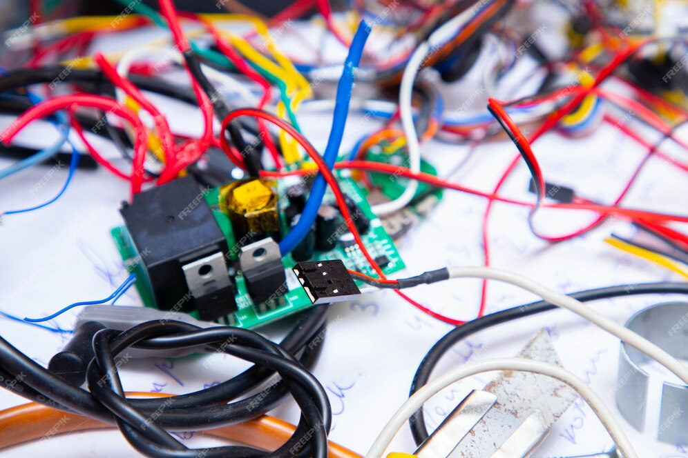

# Lab. Processamento Digital de Sinais e Controle Digital

ECP/2024.1

Tópicos previstos:

**Parte de Controle Digital**:

* [Equação de diferenças do controlador](https://fpassold.github.io/Lab_Controle_2/PID_Arduino/controlador_codigo.html) à partir de $C(z)$ (eq. do controlador no plano$-z$);
* O **[PID Digital](https://fpassold.github.io/Lab_Controle_2/PID/pid.html)** (teoria, codificação);
* **[Sistema modular MS150](Modular_Servo_System_MS150.pdf)** da [Feedback Instruments](https://www.feedback-instruments.com) 
  (adquiridos em 1995, ⏳; atual [Modular Servo System](https://www.leybold-shop.com/ve6-3-5-13.html) da [Leybold](https://www.leybold-shop.com)) (ambas marcas inglesas; Pedidos de Renovação: 2012.1; 2014/38593 - custo unitário ≅ US$ 1.250,00);
* [Arduino & Interrupções](https://fpassold.github.io/Lab_Controle_2/Arduino_Int/Arduino_Int.html) (rotinas ISR);
  * Exemplo 1) [Senóide de 40 Hz](https://fpassold.github.io/Lab_Controle_2/Projeto_Final/gerador_senoidal.html), usando saída PWM filtrada;
  * Exemplo 2) [Onda triangular de 0,1 Hz](https://fpassold.github.io/Lab_Controle_2/Projeto_Final/onda_triangular.html), usando saída PWM filtrada;
* [Sintonia prática de PID Analógico](https://fpassold.github.io/Lab_Controle_2/controle_posicao.html) usando kit Feedback (Lab. de Controle), para controle de posição angular.
  * [Método de Sintonia](https://fpassold.github.io/Lab_Controle_2/aula2/aula2b.html) baseada na busca pelo *Ultimate Gain* ($K_u$) e período de oscilação $T_u$ (teoria); 
  * "Método do Relé" para sintonia de PID: [parte 1](https://fpassold.github.io/Controle_2/8_Ajuste_PID/Sintonia_PIDs_usando_ZN.html) e [parte 2](https://fpassold.github.io/Lab_Controle_2/aula2/metodo_rele_2_simulink.html).
* [Setup previsto](https://fpassold.github.io/Lab_Controle_2/PID_Arduino/setup_arduino_PID.html) para placa Arduino + kits Feedback;
* [PID digital usando Arduino](https://fpassold.github.io/Lab_Controle_2/PID_Arduino/PID_no_Arduino.html) (rotina ISR, tempo de amostragem de 1/100 segundos; interface com usuário via Monitor Serial e Serial Plotter do Arduino);
* [Como trabalhar com módulo MPC725](https://fpassold.github.io/Lab_Controle_2/PID_Digital/modulo_DAC.html) (DAC I2C para Arduino/Raspberry);
* [Exemplo de sintonia de PID analógico](https://fpassold.github.io/Lab_Controle_2/controle_posicao.html) no controle de posição angular usando Kit Feedback.

* [Sistema de Aquecimento para Xícara de Café](https://fpassold.github.io/Lab_Controle_2/Aquecer_cafe/aquecer_cafe.html) ☕ (21/05/2024).
  **Trabalho #1**: 
  O algoritmo de controle deve ser baseado em ISR (rodando a 1 ou 10 Hz; não nos 100 Hz do PID exemplo!).
  Este algoritmo de controle deve ser do tipo Proporcional.
  Alguma "sintonização" deve ter sido realizada.
  O algoritmo deve interagir com o usuário via porta serial/USB. Isto é, parâmetros como temperatura desejada e ganhos do controlador devem poder ser variados em tempo de execução (e não através de sucessivas compilações e transferências de código para placa).
  **Deadline**: Este primeiro projeto deve ser apresentado até 04/06.
  A apresentação será realizada no primeiro intervalo da aula de 04/06, 20 minutos no máximo para cada equipe.
  A equipe pode apresentar um pequeno documento (de até 3 páginas) intitulado "**Memorial do Projeto**" que deve ressaltar detalhes do algoritmo implementado, como o controlador foi sintonizado, modificações realizadas no código exemplo do PID (fornecido na página WEB da disciplina) e eventualmente gráficos com resultados obtidos. Mas lembrem-se: são apenas 3 páginas, fonte tamanho mínimo de 9 pontos. 
  O código (arquivo .ino ou .cpp) deve ser enviado para o professor por email.

* **Trabalho #2**: Controle de Luminosidade (04/06/2024).
  O algoritmo de controle deve ser baseado em ISR (rodando a 1 ou 10 Hz; não nos 100 Hz do código exemplo para um PID).
  🫵 **Atenção**: Este algoritmo de controle deve ser do tipo **PI** ou **PID**. ⚠️ 
  Deve ser implementando um **Filtro de Média Móvel** (variando de 4 à 10 passos) para as informações adquiridas por parte do sensor (LDR).
  Alguma "sintonização" deve ser realizada.
  O algoritmo deve interagir com o usuário via porta serial/USB. Isto é, parâmetros como luminosidade desejada e ganhos do controlador devem poder ser variados em tempo de execução (e não através de sucessivas compilações e transferências de código para placa).
  **Deadline**: Este segundo projeto deve ser apresentado até 18/06.
  A apresentação será realizada no primeiro intervalo da aula de 18/06, 20 minutos no máximo para cada equipe.
  A equipe pode apresentar um pequeno documento (de até 3 páginas) intitulado "**Memorial do Projeto**" que deve ressaltar detalhes do algoritmo implementado, como o controlador foi sintonizado, modificações realizadas no código exemplo do PID (fornecido na página WEB da disciplina) e eventualmente gráficos com resultados obtidos. Mas lembrem-se: são apenas 3 páginas, fonte tamanho mínimo de 9 pontos. 
  O código (arquivo .ino ou .cpp) deve ser enviado para o professor por email.

* 🧑‍💻 [Configurando uma placa ESP32](ESP32_Dev_Kit.html).
* [Programando ESP32 no Terminal](iniciando_ESP32.html);
* [Usando VSCode com ESP32](ESP32_VSCode.html);
* **FreeRTOS**:
  * [Introdução à FreeRTOS](https://fpassold.github.io/FreeRTOS/intro_FreeRTOS.html);
  * Criação de tasks síncronas → uso da função [xTaskCreate();](https://fpassold.github.io/FreeRTOS/xTaskCreate.html)
  * Uso da função [vTaskDelayUntil();](https://fpassold.github.io/FreeRTOS/vTaskDelayUntil.html)
  * Definição de [prioridades](https://fpassold.github.io/FreeRTOS/prioridades.html);
  * [Exemplo 1](https://fpassold.github.io/FreeRTOS/controle_digital_ex1.html) de Controle Digital usando tasks síncronas.

**Parte de Processamento Digital de Sinais**:

* Filtro Passa-Baixas exponencial: [teoria](https://fpassold.github.io/Lab_Processa_Sinais/Filtro/filtro_exponencial.html);
* [Filtro de Média Móvel](https://fpassold.github.io/Process_Sinais/media_movel.html);
   	* [Função `filter()` no Matlab](https://fpassold.github.io/Process_Sinais/funcao_filter.html);
      	* [Usando algoritmo FFT](https://fpassold.github.io/Process_Sinais/usando_fft_matlab.html) (no Matlab);
	* [Convolução e Reverberação de Sinais](https://fpassold.github.io/Lab_Processa_Sinais/Lab_2/lab_2_convolucao.pdf);

* Sintetizando senoides usando $f_s=$ 2 KHz e placa Arduino Uno (previsão);

 * [Lista de compras](lista_compras_ini_2024.pdf) (solicitada em 14/03/2024). 

---

