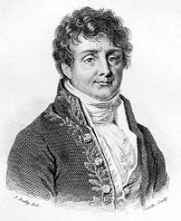
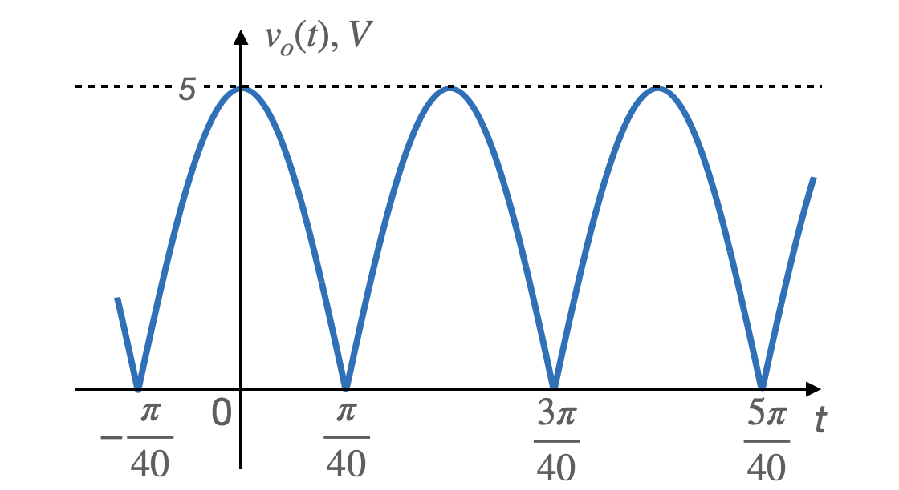
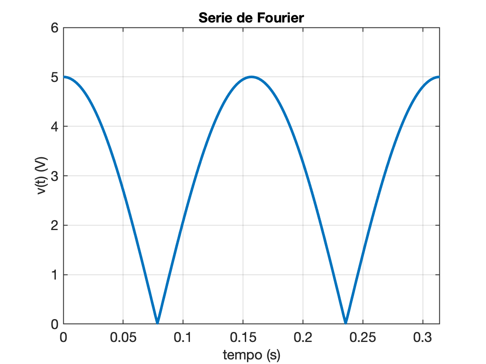
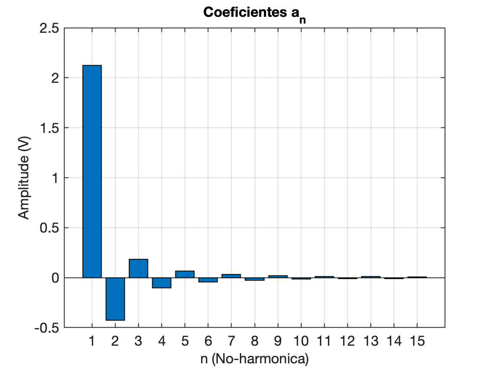
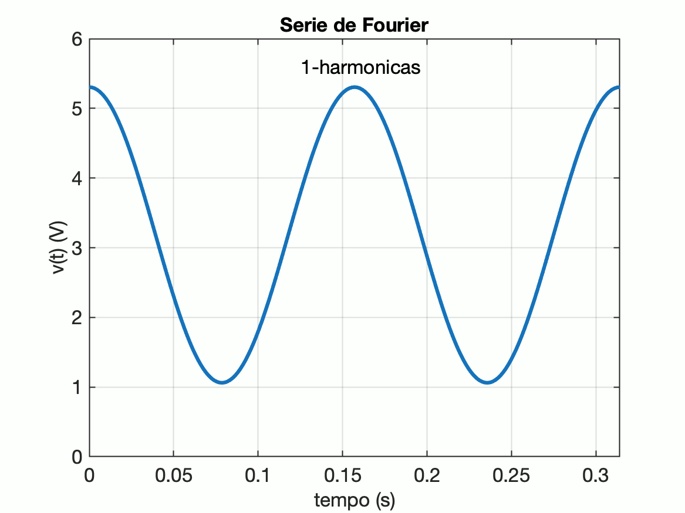
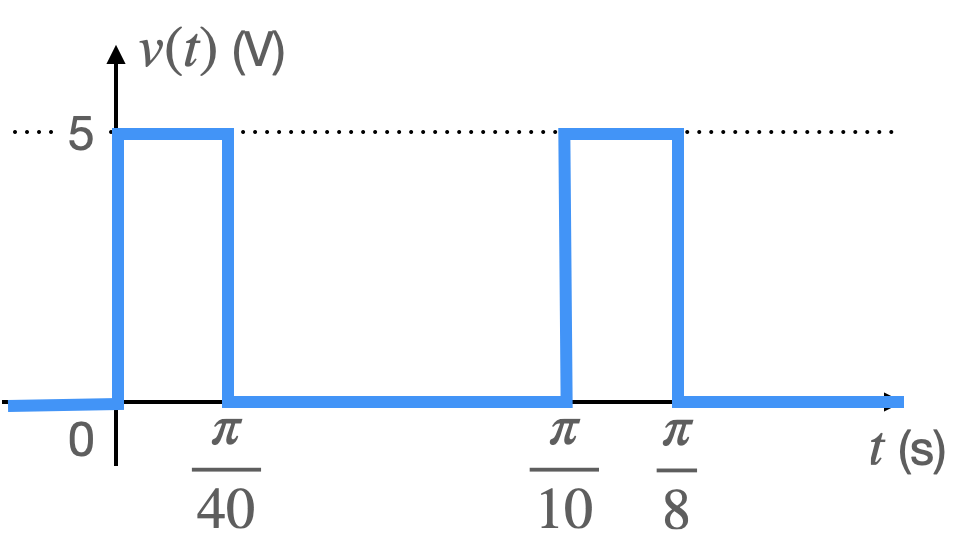
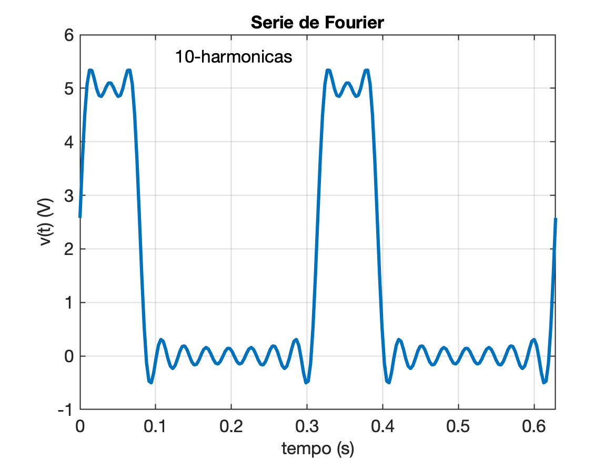
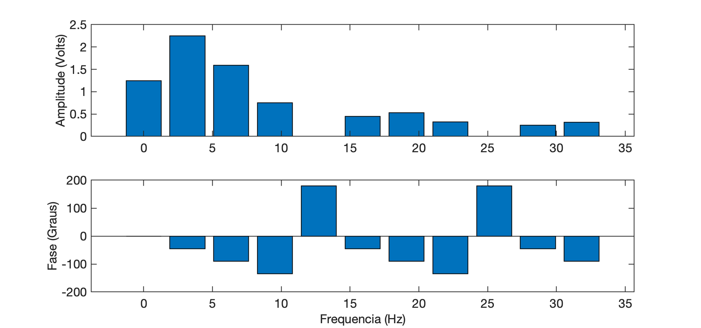

<!-- title: Série de Fourier -->

# Série de Fourier

## Introdução

Desenvolvida em 1807 pelo barão matemático Jean-Baptiste Joseph Fourier.



Qualquer forma de onda periódica pode ser expressa como uma soma infinita de funções senoidais.

Lembrando do conceito de função periódica:

$f(t)=f(t-T)$

onde $T=$período da função;
Notar que: $f_0=1/T=$ frequência (fundamental), ou:
$\omega_o=\frac{2\pi}{T}$.

**Idéia**: decompor uma função periódica em uma soma infinita de senos e cossenos, geralmente conhecida como “harmônicas”(\*):

$f(t)=a_0 + \displaystyle\sum_{n=1}^{\infty} a_n \cdot \cos \left( n \cdot \omega_0 t \right) + \displaystyle\sum_{n=1}^{\infty} b_n \cdot \sin \left( n \cdot \omega_0 t \right)$

onde: $f(t)=$ função periódica que se deseja representar;
$\omega_0=$ frequencia fundamental (notar que: $n \cdot \omega_0 = \omega_n =$ harmônica $n$ do sinal);
$a_0$, $a_n$ e $b_n$ são coeficientes da série de Fourier, que determinam a contribuição de cada componente harmônica na representação da função.

(\*)Harmônicas = múltiplos inteiros da frequencia fundamental do sinal.

Os coeficientes são calculados da seguinte forma:

$a_0=\dfrac{1}{T} \displaystyle\int_{t_0}^{t_0+T} f(t)dt =$ **valor médio** de $f(t)$;

$a_n= \dfrac{2}{T} \displaystyle\int_{t_0}^{t_0+T} f(t) \cdot \cos \left( n \cdot \omega_0 t \right) \, dt, \quad n>0$

$b_n= \dfrac{2}{T} \displaystyle\int_{t_0}^{t_0+T} f(t) \cdot \sin \left( n \cdot \omega_0 t \right) \, dt, \quad n>0$

### Exemplo
A figura abaixo representa uma onda períodica resultante de um circuito retificador de onda completa, cuja entrada é uma onda cossenoidal. Determina a série de Fourier para esta onda.



**Solução**:

1. Determinar a **frequência fundamental** do sinal:

   $T=\dfrac{3\pi}{40}-\dfrac{\pi}{40}=\dfrac{\pi}{20}$ (segundos)

   $\omega_0=\dfrac{2\pi}{T}=40$ (rad/s).

2. Cálculo do **valor médio**:

   $a_0=\dfrac{1}{T} \displaystyle\int_{t_0}^{t_0+T} f(t)dt$

   As próximas equações envolvem integrais ao longo de um período completo de $v_o(t)$. O ponto inicial do período é arbitrário e pode ser escolhido de forma a facilitar a integração. Em muitos casos, os limites mais simples são $[0, \, T]$ ou $[-T/2,\, T/2]$. Neste caso, a forma de onda pode ser representada como sendo:

   $v_o(t)=\begin{cases}
   5 \cos(20t) & \text{para: } -\dfrac{\pi}{40} \le t \le \dfrac{\pi}{40}\\
   -5 \cos(20t) & \text{para: } \dfrac{\pi}{40} \le t \le \dfrac{3\pi}{40}
   \end{cases}$

   Considerando inicialmente a integração entre 0 à T, vamos obter:

   $a_0=\dfrac{20}{\pi} \displaystyle\int_{0}^{\pi/20} v_o(t)dt = \dfrac{20}{\pi} \displaystyle\int_{0}^{\pi/40} 5 \cos(20t)dt + \dfrac{20}{\pi} \int_{\pi/40}^{\pi/20} -5 \cos(20t)dt$

   Mas, por outro lado, pode ser mais fácil integrar de $-T/2$ até $T/2$ e assim teremos:

   $a_0=\dfrac{20}{\pi} \displaystyle\int_{-\pi/40}^{\pi/40} v_o(t)dt = \dfrac{20}{\pi} \displaystyle\int_{-\pi/40}^{\pi/40} 5 \cos(20t)dt$

   (esta equação é mais simples).

   $a_0= \dfrac{20}{\pi} \displaystyle\int_{-\pi/40}^{\pi/40} 5 \cos(20t)dt = \dfrac{100}{\pi} \left( \dfrac{1}{20} \sin(20t)\Big\vert_{-\pi/40}^{\pi/40} \right)$

   $a_0=\dfrac{5}{\pi}\left[ \sin \left( \dfrac{\pi}{2} \right) -\sin \left( -\dfrac{\pi}{2} \right) \right]$

   $a_0=\dfrac{10}{\pi}$.

   

3. Cálculo de $a_n$:

   $a_n= \dfrac{2}{T} \displaystyle\int_{t_0}^{t_0+T} f(t) \, \cos \left( n \cdot \omega_0 t \right) \, dt, \quad n>0$

   $a_n=\dfrac{40}{\pi} \displaystyle\int_{-\pi/40}^{\pi/40} 5 \cos(20\,t) \cdot \cos(n \cdot \omega_0 t) \, dt$

   $a_n=\dfrac{40}{\pi} \displaystyle\int_{-\pi/40}^{\pi/40} 5 \cos(20t) \cos(40nt)\,dt$

   Usando identidades trigonométricas, lembramos que:

   xx

   O que resulta em:

   $\begin{array}{rcl}\cos(20t)\cos(40nt)&=&\dfrac{1}{2} \Big[ \cos(20t+40nt) + \cos(20t+40nt) \Big]\\&=& \dfrac{1}{2} \Big\{ \cos[(1+2n)20t] + \cos[(1-2n)20t] \Big\} \end{array}$

   $a_n=\dfrac{100}{\pi} \displaystyle\int_{-\pi/40}^{\pi/40} \Big\{ \cos[(1+2n)20t] + \cos[(1-2n)20t] \Big\}$

   $a_n=\dfrac{100}{\pi} \Big\{ \dfrac{\sin[(1+2n)20t]}{(1+2n)20} \Big\vert_{-\pi/40}^{\pi/40} + \dfrac{\sin[(1-2n)20t]}{(1-2n)20} \Big\vert_{-\pi/40}^{\pi/40} \Big\}$

   $a_n=\dfrac{5}{\pi}\left({ \dfrac{ \sin\left({ (1+2n)\dfrac{\pi}{2} }\right) - sin\left({ -(1+2n)\dfrac{\pi}{2} }\right)}{(1+2n)} + \dfrac{ \sin\left({ (1-2n)\dfrac{\pi}{2} }\right) - sin\left({ -(1-2n)\dfrac{\pi}{2} }\right)}{(1-2n)} }\right)$

   $a_n=\dfrac{5}{\pi} \left({ \dfrac{2(-1)^n}{(1+2n)} + \dfrac{2(-1)^n}{(1-2n)} }\right)$

   $a_n=\dfrac{20(-1)^n}{\pi(1-4n^2)}$

4. Calculando $b_n$

   $b_n= \dfrac{2}{T} \displaystyle\int_{t_0}^{t_0+T} f(t) \cdot \sin \left( n \cdot \omega_0 t \right) \, dt, \quad n>0$

   $b_n=\dfrac{40}{\pi} \displaystyle\int_{-\pi/40}^{\pi/40} 5 \cos(20t) \, \sin(40nt) \, dt$

   $b_n=\dfrac{100}{\pi} \displaystyle\int_{-\pi/40}^{\pi/40} \left( \sin\left( (2n+1)20t \right) + \sin\left( (2n-1)20t \right) \right) \, dt$

   $b_n=\dfrac{100}{\pi} \Big\{ \dfrac{\cos[(1+2n)20t]}{(1+2n)20} \Big\vert_{-\pi/40}^{\pi/40} + \dfrac{-\cos[(1-2n)20t]}{(1-2n)20} \Big\vert_{-\pi/40}^{\pi/40} \Big\}$

   $b_n=0$

5. Resumindo:

   $a_0=\dfrac{10}{\pi}$;

   $a_n=\dfrac{20(-1)^n}{\pi(1-4n^2)}$;

   $b_n=0$,

   ou seja:

   $v_o(t)=\dfrac{10}{\pi} + \dfrac{20}{\pi} \displaystyle\sum_{n=1}^{\infty} \dfrac{(-1)^n}{1-4nˆ2} \, \cos(40nt)$

Simulando a solução encontrada usando MATLAB:

```Matlab
% exe_15_2_1.m
%
% Exemplo de Série de Fourier - aplicacao
% Exemplo 15.2.1 de Dorf, ...
%
% Fernando Passold, em 13/09/2023
disp('Periodo do sinal:')
T=pi/20
disp('Frequencia (fundamental, Hz):')
f=1/T
disp('Valor medio:')
a0=10/pi

% calculando coeficientes a_n e b_n
w0 = 2*pi/T;    % freq fundamental, em rad/s
tf = 2*T;       % tempo final
dt = tf/200;    % incremente de tempo
t = 0:dt:tf;    % cria vetor tempo

disp('Calculando v(t) usando Série de Fourier...')
v = a0*ones(size(t));   % inicia com vetor v(t) zerado
for n = 1:100   % 100 harmonicas
    an = 20*((-1)^n)/(pi*(1-4*n^2));
    bn = 0;
    v = v + an*cos(n*w0*t) + bn*sin(n*w0*t);
end

% Plotando o gráfico resultante
plot(t, v)
axis([0 tf 0 6])
grid
xlabel('tempo (s)')
ylabel('v(t) (V)')
title('Serie de Fourier')
```

Obtemos o seguinte resultado:

```Matlab
>> exe_15_2_1
Periodo do sinal:
T =
      0.15708
Frequencia (fundamental, Hz):
f =
       6.3662
Valor medio:
a0 =
       3.1831
Calculando v(t) usando Série de Fourier...
>> 
```

e o gráfico:



Obs.: Note que a primeira figura foi obtida, fazendo-se no MATLAB:

```Matlab
>> ezplot('5*abs(cos(20*t))',[-1.2*pi/40 1.1*5*pi/40])
```

Se os coeficientes $a_0$ e $a_n$ fossem impressos para as primeiras 15 harmônicas, teríamos:

```matlab
>> a0
a0 =
       3.1831
       
a_1 = 2.12207
a_2 = -0.424413
a_3 = 0.181891
a_4 = -0.101051
a_5 = 0.064305
a_6 = -0.0445189
a_7 = 0.0326472
a_8 = -0.0249655
a_9 = 0.0197096
a_10 = -0.0159554
a_11 = 0.0131805
a_12 = -0.0110716
a_13 = 0.0094314
a_14 = -0.00813052
a_15 = 0.00708142
```

Um gráfico dos primeiros 15 coeficientes $a_n$ resulta em:



Se apenas as 7 primeiras harmônicas fossem usadas para tentar sintetizar $v_o(t)$ iríamos obter:



**Continuando**...

## Formato exponencial para Série de Fourier

As expressões já vistas anteriormente para o cálculo da Série de Fourier, se referem ao seu "**formato trigonométrico**" (ou formato "seno-cosseno"):

$f(t)=a_0+ \displaystyle\sum_{n=1}^{\infty} \left( a_n \cos(n \, \omega_0 t) + b_n \sin(n \, \omega_0 t ) \right)$

Lembrando da identidade trigonométrica:

> $\sin(\alpha) = \cos(\alpha - 90^o)$

o $n-$ésimo termo da série (trigonométrica de Fourier) pode ser escrito como:

$a_n \cos(n \, \omega_0 t) + b_n \sin(n \, \omega_0 t) = a_n \cos( n \, \omega_0 t) + b_n \cos(n \, \omega_0 t - 90^o)$

Lembrando ainda de **fasores**, podemos representar o lado direito da eq. Anterior no domínio da frequência. Convertendo da forma retangular para a forma polar:

$a_n \angle{0} + b_n \angle{-90^o} = a_n - j b_n = c_n \angle{\theta_n}$

Note que:

$c_n=\sqrt{a_n^2 + b_n^2}$

$\theta = \begin{cases} -\tan^{-1} \left( \dfrac{b_n}{a_n} \right) & \text{para } a_n>0\\ 180^o-\tan{-1}\left( \dfrac{b_n}{a_n} \right) & \text{para } a_n < 0 \end{cases}$

ou podemos ainda escrever:

$a_n=c_n \cos(\theta_n)$

$b_n=-c_n \sin(\theta_n)$

Voltando ao domínio tempo, a senóide fica então:

$c_n \cos(n \, \omega_0 t + \theta_n)$

Onde:

$c_0=a_0=$ valor médio de $f(t)$

e assim, a série de Fourier no **formato exponencial** (ou formato "amplitude-fase") ficaria:

$f(t) = c_0 + \displaystyle\sum_{n=1}^{\infty} c_n \, \cos(n \, \omega_0 t + \theta_n)$

Em geral é mais fácil calcular os coeficientes $a_n$ e $b_n$ que calcular $c_n$ e $\theta_n$, especialmente se a função $f(t)$ for simétrica.

A série de Fourier baseada nos termos $c_n$ e $\theta_n$ é mais conveniente para calcular a resposta estacionária de um sistema para uma entrada periódica.

### Exemplo

Determine a série de Fourier para a onda pulsada mostrada na figura à seguir:



**Solução**:

1. Determinando o período $T$:

   $T=\dfrac{\pi}{10}$ (Segundos)

   A frequência fundamental é então:

   $\omega_0 = \dfrac{2\pi}{T} = 20$ (rad/s)

2. No período de 0 à $\pi/10$, a forma de onde pode ser descrita como:
   
   $v(t) = \begin{cases} 5 & \text{para } 0 \le t \le \dfrac{\pi}{40}\\ 0 & \text{para } \dfrac{\pi}{40} \le t \le \dfrac{\pi}{10} \end{cases}$
   
3. Calculando os coeficientes $a_0$, $a_n$ e $b_n$.

   Calculando $a_0$ que o valor médio, temos:

   $a_0=\dfrac{\acute{a}\text{rea sobre a curva para 1 período}}{\text{1 periodo, }T}$
   
   $a_0=\dfrac{5 \left( \dfrac{\pi}{40} \right) + 0 \left( \dfrac{3\pi}{40} \right)}{ \dfrac{\pi}{10} }$
   
   $a_0=1,25$ (Volts)
   
   Cálculo de $a_n$:
   
   $a_n= \dfrac{2}{T} \displaystyle\int_{t_0}^{t_0+T} f(t) \cdot \cos \left( n \cdot \omega_0 t \right) \, dt, \quad n>0$
   
   $a_n=\dfrac{20}{\pi} \displaystyle\int_{0}^{\pi/40} 5 \cdot \cos(n \cdot \omega_0 t)dt + \dfrac{20}{\pi} \displaystyle\int_{\pi/40}^{\pi/10} 0 \cdot \cos(n \cdot \omega_0 t)dt$
   
   $a_n=\dfrac{20}{\pi} \displaystyle\int_{0}^{\pi/40} 5 \cdot \cos(20 n t)dt$
   
   $a_n=\dfrac{20(5)}{\pi} \left( \dfrac{ \sin(20nt) }{20n} \Big\vert_0^{\pi/40} \right)$
   
   $a_n=\dfrac{5}{n\pi} \sin\left( \dfrac{n\pi}{2} \right)$
   
   Cálculo de $b_n$:
   
   $b_n= \dfrac{2}{T} \displaystyle\int_{t_0}^{t_0+T} f(t) \cdot \sin \left( n \cdot \omega_0 t \right) \, dt, \quad n>0$
   
   $b_n=\dfrac{20}{\pi} \displaystyle\int_{0}^{\pi/40} 5 \cdot \sin(n \cdot \omega_0 t)dt + \dfrac{20}{\pi} \displaystyle\int_{\pi/40}^{\pi/10} 0 \cdot \sin(n \cdot \omega_0 t)dt$
   
   $b_n=\dfrac{20}{\pi} \displaystyle\int_{0}^{\pi/40} 5 \cdot \sin(20 n t)dt$
   
   $b_n=\dfrac{20(5)}{\pi} \left( \dfrac{ -\cos(20nt) }{20n} \Big\vert_0^{\pi/40} \right)$
   
   $b_n=\dfrac{5}{n\pi} \left( 1 - \cos \left( \dfrac{n\pi}{2} \right) \right)$
   
4. Resumindo:

   $a_0=1,25$ (Volts)

   $a_n=\dfrac{5}{n\pi} \sin\left( \dfrac{n\pi}{2} \right)$

   $b_n=\dfrac{5}{n\pi} \left( 1 - \cos \left( \dfrac{n\pi}{2} \right) \right)$

   ou seja:

   $v(t) = 1,25 + \dfrac{5}{n\pi} \displaystyle\sum_{n=1}^{\infty} \left( \sin \left( \dfrac{n\pi}{2} \right) \cos(20\,nt) + \left( 1 - \cos \left( \dfrac{n\pi}{2}  \right)  \right) \sin (20\,nt) \right)$

5. Simulando no MATLAB.

```matlab
% exe_15_2_2.m
%
% Exemplo de Série de Fourier - aplicacao
% Exemplo 15.2.2 de Dorf, ...
%
% Fernando Passold, em 13/09/2023

clear a b c theta	% limpa algum conteudo anterior na memoria

disp('Periodo do sinal:')
T=pi/10
disp('Frequencia (fundamental, Hz):')
f=1/T
disp('Valor medio:')
a0=1.25

% calculando coeficientes a_n e b_n
w0 = 2*pi/T;    % freq fundamental, em rad/s
tf = 2*T;       % tempo final
dt = tf/200;    % incremente de tempo
t = 0:dt:tf;    % cria vetor tempo

h = input('Numero desejado de harmonicas? ');

disp('Calculando v(t) usando Série de Fourier...')
v = a0*ones(size(t));   % inicia com vetor v(t) zerado
cont = 0;
for n = 1:h   % 100 harmonicas
    an = ( 5/(n*pi) )*sin( (n*pi)/2 );
    a(n) = an;
    bn = ( 5/(n*pi) )*( 1 - cos( (n*pi)/2 ) );
    b(n) = bn;
    cn = abs(an - j*bn);
    c(n) = cn;
    thetan = angle(an - j*bn);
    theta(n) = thetan;
    v = v + an*cos(n*w0*t) + bn*sin(n*w0*t);
    cont = cont + 1;
end

% Plotando o gráfico resultante
plot(t, v)
axis([0 tf -1 6])
grid
xlabel('tempo (s)')
ylabel('v(t) (V)')
title('Serie de Fourier')
aux=num2str(h);
texto = [aux '-harmonicas'];
text(0.125, 5.6, texto)
```

Executando:

```matlab
> exe_15_2_2
Periodo do sinal:
T =
      0.31416
Frequencia (fundamental, Hz):
f =
       3.1831
Valor medio:
a0 =
         1.25
Numero desejado de harmonicas? 10
Calculando v(t) usando Série de Fourier...
>> [c' theta'.*(180/pi)]
ans =
       2.2508          -45
       1.5915          -90
      0.75026         -135
   9.7454e-17          180
      0.45016          -45
      0.53052          -90
      0.32154         -135
   9.7454e-17          180
      0.25009          -45
      0.31831          -90
      0.20462         -135
   9.7454e-17          180
      0.17314          -45
      0.22736          -90
      0.15005         -135
   9.7454e-17          180
       0.1324          -45
      0.17684          -90
      0.11846         -135
   9.7454e-17          180
>> 
```

E rende o gráfico:



Note que podemos vizualizar um espectro do sinal:

```matlab
>> k=0:n; % vetor de componentes  do sinal
>> ff = f.*k;	% vetor contendo as frequencias
>> % Falta acrescentar componentes "DC":
>> c = [a0 c];
>> theta = [0 theta];
>> [k' ff' c' theta'.*(180/pi)] % imprimindo uma "tabela"
ans =
            0            0         1.25            0
            1       3.1831       2.2508          -45
            2       6.3662       1.5915          -90
            3       9.5493      0.75026         -135
            4       12.732   9.7454e-17          180
            5       15.915      0.45016          -45
            6       19.099      0.53052          -90
            7       22.282      0.32154         -135
            8       25.465   9.7454e-17          180
            9       28.648      0.25009          -45
           10       31.831      0.31831          -90
>> 
```

Na forma de um gráfico:

```matlab
>> figure	% abre nova janela gráfica (vazia)
>> subplot(211); bar(ff, c)
>> ylabel('Amplitude (Volts)')
>> subplot(212); bar(ff, theta'.*(180/pi))
>> ylabel('Fase (Graus)')
>> xlabel('Frequencia (Hz)')
```

E temos então:



----

Fernando Passold, em 13/09/2023
