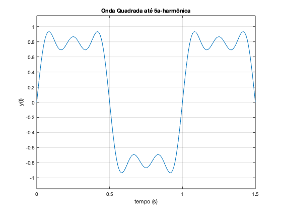
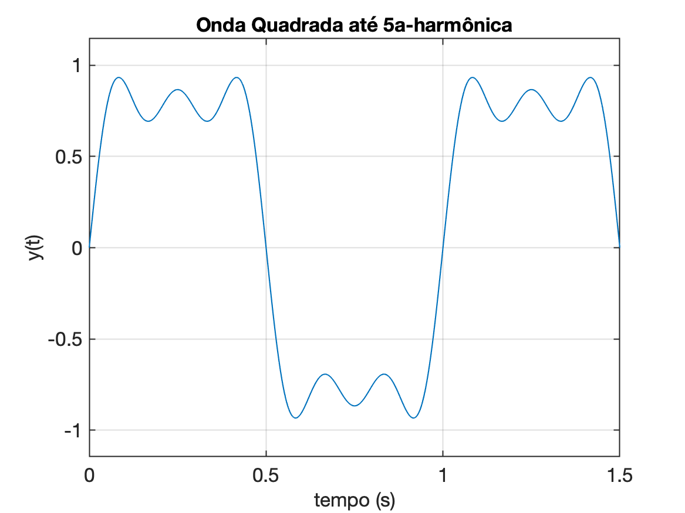
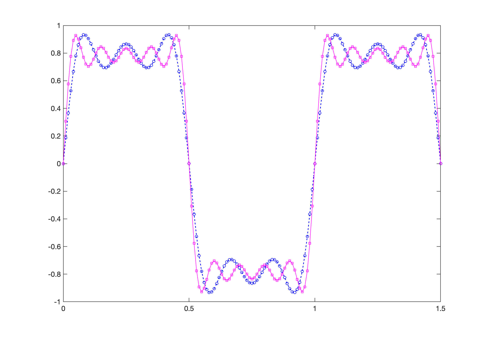

# Exemplo uso inicial Matlab

>   Aula de 26/10/2023

Tópicos abordados:

- [Exemplo uso inicial Matlab](#exemplo-uso-inicial-matlab)
  - [Introdução](#introdução)
    - [Comando `diary`](#comando-diary)
    - [Outros comandos iniciais básicos](#outros-comandos-iniciais-básicos)
  - [Operações matemáticas simples](#operações-matemáticas-simples)
    - [O comando `format`](#o-comando-format)
    - [Números complexos](#números-complexos)
    - [Descobrindo variáveis já criadas](#descobrindo-variáveis-já-criadas)
    - [format shortg \& format long](#format-shortg--format-long)
  - [Criando vetores e matrizes](#criando-vetores-e-matrizes)
  - [Limpando variáveis da memório (comando `clear`)](#limpando-variáveis-da-memório-comando-clear)
    - [Mais operações com números complexos](#mais-operações-com-números-complexos)
  - [Operações com matrizes](#operações-com-matrizes)
  - [Criando gráficos](#criando-gráficos)
    - [Comando `ezplot()`](#comando-ezplot)
    - [Plotando vetores (comando `plot`)](#plotando-vetores-comando-plot)
      - [Opções do comando `plot()`](#opções-do-comando-plot)
  - [Salvando figuras para formato Markdown](#salvando-figuras-para-formato-markdown)
  - [Aprofundando conhecimentos em Markdown](#aprofundando-conhecimentos-em-markdown)


## Introdução

### Comando `diary`

Recomenda-se ao entrar no Matlab, criar um "diário" dos comandos usados nesta seção de trabalho. Algo como:

```matlab
>> diary aula_26oct2023.txt
```

Isto faz com o que o Matlab crie um arquivo texto usando o nome que foi indicado (no caso: `aula_26oct2023.txt`). Este arquivo é criado em segundo plano, refletindo todos os comandos, resultados (e erros) cometidos durante sua utilização, até que o usuário dê um `diary off`. 

:warning: O comando `diary off` encera a geração deste aquivo e fecha este arquivo (importante para usuários Windows caso contrário o arquivo não é "fechado" e acaba sendo perdido) 

### Outros comandos iniciais básicos

```matlab
>> pwd % este comando confirma o diretório atual de trabalho no Matlab
ans =
    '/Users/fernandopassold/Documents/MATLAB'

>> ver % descobrir versão do Matlab e toolboxes instalados
-----------------------------------------------------------------------------------------------------
MATLAB Version: 9.7.0.1190202 (R2019b)
MATLAB License Number: 968398
Operating System: macOS  Version: 13.6 Build: 22G120 
Java Version: Java 1.8.0_202-b08 with Oracle Corporation Java HotSpot(TM) 64-Bit Server VM mixed mode
-----------------------------------------------------------------------------------------------------
MATLAB                                                Version 9.7         (R2019b)
Simulink                                              Version 10.0        (R2019b)
Audio Toolbox                                         Version 2.1         (R2019b)
Communications Toolbox                                Version 7.2         (R2019b)
Computer Vision Toolbox                               Version 9.1         (R2019b)
Control System Toolbox                                Version 10.7        (R2019b)
Curve Fitting Toolbox                                 Version 3.5.10      (R2019b)
DSP System Toolbox                                    Version 9.9         (R2019b)
Deep Learning Toolbox                                 Version 13.0        (R2019b)
Fixed-Point Designer                                  Version 6.4         (R2019b)
Fuzzy Logic Toolbox                                   Version 2.6         (R2019b)
Global Optimization Toolbox                           Version 4.2         (R2019b)
Image Acquisition Toolbox                             Version 6.1         (R2019b)
Image Processing Toolbox                              Version 11.0        (R2019b)
MATLAB Parallel Server                                Version 7.1         (R2019b)
MATLAB Report Generator                               Version 5.7         (R2019b)
Optimization Toolbox                                  Version 8.4         (R2019b)
Parallel Computing Toolbox                            Version 7.1         (R2019b)
Partial Differential Equation Toolbox                 Version 3.3         (R2019b)
ROS Toolbox                                           Version 1.0         (R2019b)
Reinforcement Learning Toolbox                        Version 1.1         (R2019b)
Robotics System Toolbox                               Version 3.0         (R2019b)
Sensor Fusion and Tracking Toolbox                    Version 1.2         (R2019b)
Signal Processing Toolbox                             Version 8.3         (R2019b)
SimEvents                                             Version 5.7         (R2019b)
Simscape                                              Version 4.7         (R2019b)
Simscape Driveline                                    Version 3.0         (R2019b)
Simscape Electrical                                   Version 7.2         (R2019b)
Simscape Fluids                                       Version 2.7         (R2019b)
Simscape Multibody                                    Version 7.0         (R2019b)
Simulink 3D Animation                                 Version 8.3         (R2019b)
Simulink Control Design                               Version 5.4         (R2019b)
Simulink Report Generator                             Version 5.7         (R2019b)
Stateflow                                             Version 10.1        (R2019b)
Statistics and Machine Learning Toolbox               Version 11.6        (R2019b)
Symbolic Math Toolbox                                 Version 8.4         (R2019b)
System Identification Toolbox                         Version 9.11        (R2019b)
mem

>> memory  % Descobrir como o Matlab usa se sistema (só Windows)
Function MEMORY is not available on this platform.}
``````

## Operações matemáticas simples

Seguem exemplos de operações matemáticas simples:

```matlab
>> 5+7
ans =
    12
>> cos(pi/4) % Lembrar que argumento de entrada sempre será radianos
ans =
      0.70711
```

### O comando `format`

O Matlab permite expressar resultados numéricos de diferentes formas:

```matlab
>> format shorteng
i=15/10E3
i =
     1.5000e-003
>> format shortg
2/4
ans =
          0.5
4/4
ans =
     1
>> help format
 <strong>format</strong> Set output format.
    <strong>format</strong> with no inputs sets the output format to the default appropriate
    for the class of the variable. For float variables, the default is
    <strong>format</strong> SHORT.

    <strong>format</strong> does not affect how MATLAB computations are done. Computations
    on float variables, namely single or double, are done in appropriate
    floating point precision, no matter how those variables are displayed. 
    Computations on integer variables are done natively in integer. Integer
    variables are always displayed to the appropriate number of digits for
    the class, for example, 3 digits to display the INT8 range -128:127.
    <strong>format</strong> SHORT and LONG do not affect the display of integer variables.
     
    <strong>format</strong> may be used to switch between different output display formats
    of all float variables as follows:
      <strong>format</strong> SHORT     Scaled fixed point format with 5 digits.
      <strong>format</strong> LONG      Scaled fixed point format with 15 digits for double
                       and 7 digits for single.
      <strong>format</strong> SHORTE    Floating point format with 5 digits.
      <strong>format</strong> LONGE     Floating point format with 15 digits for double and
                       7 digits for single.
      <strong>format</strong> SHORTG    Best of fixed or floating point format with 5 
                       digits.
      <strong>format</strong> LONGG     Best of fixed or floating point format with 15 
                       digits for double and 7 digits for single.
      <strong>format</strong> SHORTENG  Engineering format that has at least 5 digits
                       and a power that is a multiple of three
      <strong>format</strong> LONGENG   Engineering format that has exactly 16 significant
                       digits and a power that is a multiple of three.
     
    <strong>format</strong> may be used to switch between different output display formats
    of all numeric variables as follows:
      <strong>format</strong> HEX     Hexadecimal format.
      <strong>format</strong> +       The symbols +, - and blank are printed 
                     for positive, negative and zero elements.
                     Imaginary parts are ignored.
      <strong>format</strong> BANK    Fixed format for dollars and cents.
      <strong>format</strong> RAT     Approximation by ratio of small integers.  Numbers
                     with a large numerator or large denominator are
                     replaced by *.
     
    <strong>format</strong> may be used to affect the spacing in the display of all
    variables as follows:
      <strong>format</strong> COMPACT Suppresses extra line-feeds.
      <strong>format</strong> LOOSE   Puts the extra line-feeds back in.
     
    Example:
       format short, pi, single(pi)
    displays both double and single pi with 5 digits as 3.1416 while
       format long, pi, single(pi)
    displays pi as 3.141592653589793 and single(pi) as 3.1415927.
     
       format, intmax('uint64'), realmax
    shows these values as 18446744073709551615 and 1.7977e+308 while
       format hex, intmax('uint64'), realmax
    shows them as ffffffffffffffff and 7fefffffffffffff respectively.
    The HEX display corresponds to the internal representation of the value
    and is not the same as the hexadecimal notation in the C programming
    language.
     
    See also <a href="matlab:help disp">disp</a>, <a href="matlab:help display">display</a>, <a href="matlab:help isnumeric">isnumeric</a>, <a href="matlab:help isfloat">isfloat</a>, <a href="matlab:help isinteger">isinteger</a>.
    
    <a href="matlab:doc format">Documentation for format</a>
```

Exemplificando o comando `format`:

```matlab
>> a=2/4
a =
          0.5
>> format rat
>> a
a =
       1/2     
>> format shortg    % formato mais recomendado
>> b=4;
>> c=a*b
c =
     2
>> size(c) % descobrir as dimensões da variável
ans =
     1     1
```

### Números complexos

```matlab
>> a=[1+2*i 1-2*i]  % tentando ingressar números complexos
a =
        1.003        0.997
>> a=[1+i*2 1-i*2]  % tentando ingressar números complexos
a =
        1.003        0.997
>> a=[1+j*2 1-j*2]  % tentando ingressar números complexos
a =
            1 +          2i            1 -          2i
>> % Obs.: Antes não "funcinou" porque variável i já havia sido criada e usada
>> size(a)
ans =
     1     2
>> b=5*j*7  % operação com números complexos
b =
            0 +         35i
>> c=sqrt(-4)   % raiz quadrada resultando em número imaginário
c =
            0 +          2i
>> size(c)
ans =
     1     1
```

### Descobrindo variáveis já criadas

```Matlab
>> who     % apenas lista variáveis existentes

Your variables are:

a    ans  b    c    i    

>> whos    % lista variáveis e passa informações sobre tipo e dimensões das mesmas
  Name      Size            Bytes  Class     Attributes

  a         1x2                32  double    complex   
  ans       1x2                16  double              
  b         1x1                16  double    complex   
  c         1x1                16  double    complex   
  i         1x1                 8  double              
```

### format shortg & format long

```Matlab
>> a=5/7
a =
      0.71429
>> format long     % mostrando todas as casas decimais
>> a
a =
   0.714285714285714
>> format shortg   % mostrando até 4 ou 5 casas decimais se necessário
>> a
a =
      0.71429
```

## Criando vetores e matrizes

```matlab
>> a = ones(100,100);   % cria matriz de 100 x 100 repleta de 1's
>> size(a)              % confirmando tamanho da matriz criada
ans =
   100   100
>> whos
  Name        Size             Bytes  Class     Attributes

  a         100x100            80000  double              
  ans         1x2                 16  double              
  b           1x1                 16  double    complex   
  c           1x1                 16  double    complex   
  i           1x1                  8  double              
```

## Limpando variáveis da memório (comando `clear`)

```matlab
>> clear a     % apaga variável a
>> whos
  Name      Size            Bytes  Class     Attributes

  ans       1x2                16  double              
  b         1x1                16  double    complex   
  c         1x1                16  double    complex   
  i         1x1                 8  double              

>> clear all   % apaga todas as variáveis
>> whos        % confirmando que não há mais variáveis
>>
```

### Mais operações com números complexos

```matlab
>> a = 2+2*i
a =
            2 +          2i
>> b = sqrt(a)
b =
       1.5538 +    0.64359i
>> a_real = abs(a)      % calculando o módulo de um número complexo
a_real =
       2.8284
>> sqrt(2^2+2^2)        % confirmando resultado anterior
ans =
       2.8284
>> a_angle = angle(a)   % extraíndo angulo de um número complexo
a_angle =
       0.7854
>> a_degrees = a_angle*180/pi   % convertendo resutado de rad para graus
a_degrees =
    45
>> b = 4*2
b =
     8
>> b = 4*a
b =
            8 +          8i
>> c = a^2
c =
            0 +          8i
```

## Operações com matrizes

```matlab
>> a = [1 2; 3 4];
a
a =
     1     2
     3     4
>> size(a)
ans =
     2     2

>> b = ones(2,2)
b =
     1     1
     1     1
>> c = a*b       % multiplicação de matrizes
c =
     3     3
     7     7
>> d = [1,-1]
d =
     1    -1
>> e = a*d       % tentando multiplicar estas raízes
Error using 
Incorrect dimensions for matrix multiplication. Check that the number of
columns in the first matrix matches the number of rows in the second matrix.
To perform elementwise multiplication, use '.*'.
>> e = a.*d      % multiplicação elemento-à-elemento
e =
     1    -2
     3    -4
>> f = d*a        % esta multiplicação (de matrizes), funciona
f =
    -2    -2

>> who            % confirmando tipos de variáveis

Your variables are:

a          a_degrees  ans        c          e          
a_angle    a_real     b          d          f          

>> A = 100         % Matlab diferencia maiúsculas de minúsculas
A =
   100
>> a
a =
     1     2
     3     4

>> pi               % constante pi (pré-definida)
ans =
       3.1416

>> A=[1 2; 3 4]; b=[5; 6]; y=[7; 8];   % multiplas declarações na mesma linha
>> b
b =
     5
     6
>> x = (y-b)/A
Error using 
Matrix dimensions must agree. 
>> aux=y-b
aux =
     2
     2
>> aux = aux'    % realizando transposta de uma matriz
aux =
     2     2
>> x=aux/A
x =
           -1            1
>> x=(y-b)\A
x =
            1          1.5
x=(y-b)\A
x =
            1   ''       1.5
```

## Criando gráficos

### Comando `ezplot()`

```Matlab
help ezplot
 <strong>ezplot</strong>   (NOT RECOMMENDED) Easy to use function plotter

  ==========================================================
  <strong>ezplot</strong> is not recommended. Use FPLOT or FIMPLICIT instead.
  ==========================================================

    <strong>ezplot</strong>(FUN) plots the function FUN(X) over the default domain
    -2*PI < X < 2*PI, where FUN(X) is an explicitly defined function of X.
     
    <strong>ezplot</strong>(FUN2) plots the implicitly defined function FUN2(X,Y) = 0 over
    the default domain -2*PI < X < 2*PI and -2*PI < Y < 2*PI.
     
    <strong>ezplot</strong>(FUN,[A,B]) plots FUN(X) over A < X < B.
    <strong>ezplot</strong>(FUN2,[A,B]) plots FUN2(X,Y) = 0 over A < X < B and A < Y < B.
     
    <strong>ezplot</strong>(FUN2,[XMIN,XMAX,YMIN,YMAX]) plots FUN2(X,Y) = 0 over
    XMIN < X < XMAX and YMIN < Y < YMAX.
     
    <strong>ezplot</strong>(FUNX,FUNY) plots the parametrically defined planar curve FUNX(T)
    and FUNY(T) over the default domain 0 < T < 2*PI.
     
    <strong>ezplot</strong>(FUNX,FUNY,[TMIN,TMAX]) plots FUNX(T) and FUNY(T) over
    TMIN < T < TMAX.
     
    <strong>ezplot</strong>(FUN,[A,B],FIG), <strong>ezplot</strong>(FUN2,[XMIN,XMAX,YMIN,YMAX],FIG), or
    <strong>ezplot</strong>(FUNX,FUNY,[TMIN,TMAX],FIG) plots the function over the
    specified domain in the figure window FIG.
     
    <strong>ezplot</strong>(AX,...) plots into AX instead of GCA or FIG.
     
    H = <strong>ezplot</strong>(...) returns handles to the plotted objects in H.
     
    Examples:
    The easiest way to express a function is via a string:
       ezplot('x^2 - 2*x + 1')
     
    One programming technique is to vectorize the string expression using
    the array operators .* (TIMES), ./ (RDIVIDE), .\ (LDIVIDE), .^ (POWER).
    This makes the algorithm more efficient since it can perform multiple
    function evaluations at once.
       ezplot('x.*y + x.^2 - y.^2 - 1')
     
    You may also use a function handle to an existing function. Function
    handles are more powerful and efficient than string expressions.
       ezplot(@humps)
       ezplot(@cos,@sin)
     
    <strong>ezplot</strong> plots the variables in string expressions alphabetically.
       subplot(1,2,1), ezplot('1./z - log(z) + log(-1+z) + t - 1')
    To avoid this ambiguity, specify the order with an anonymous function:
       subplot(1,2,2), ezplot(@(z,t)1./z - log(z) + log(-1+z) + t - 1)
     
    If your function has additional parameters, for example k in myfun:
       %-----------------------%
       function z = myfun(x,y,k)
       z = x.^k - y.^k - 1;
       %-----------------------%
    then you may use an anonymous function to specify that parameter:
       ezplot(@(x,y)myfun(x,y,2))
     
    See also <a href="matlab:help ezcontour">ezcontour</a>, <a href="matlab:help ezcontourf">ezcontourf</a>, <a href="matlab:help ezmesh">ezmesh</a>, <a href="matlab:help ezmeshc">ezmeshc</a>, <a href="matlab:help ezplot3">ezplot3</a>, <a href="matlab:help ezpolar">ezpolar</a>,
             <a href="matlab:help ezsurf">ezsurf</a>, <a href="matlab:help ezsurfc">ezsurfc</a>, <a href="matlab:help plot">plot</a>, <a href="matlab:help vectorize">vectorize</a>, <a href="matlab:help function_handle">function_handle</a>.
    
    <a href="matlab:doc ezplot">Documentation for ezplot</a>
    <a href="matlab:matlab.internal.language.introspective.overloads.displayOverloads('ezplot')">Other functions named ezplot</a>

>> ezplot('sin(2*pi*t)+(1/3)*sin(2*pi*3*t)+(1/5)*sin(2*pi*5*t)', [0 1.5])
>> xlabel('tempo (s)')
>> ylabel('y(t)')
>> grid
>> title('Onda Quadrada até 5a-harmônica')
```

Resultado:



O gráfico anterior segue resolução "default" do Matlab para a tela do computador (algo como 96 dpi) e fontes de tamanho reduzido, bom para visualizações na tela, mas ruim para incorporação, redimensionamento ou impressão de documentos usando estes gráficos.

Se aconselha então, na janela do gráfico, modificar algums propriedaddes, ativando a opção "**Export Setup**" e modificar alguns parâmetros:

* Resolução: 150 dpi
* Tamanho de fonte mínima: 14 pts
* Espessura das linhas para mínimo de 1 pts

Obs.: Não será necessário repetir todos estes ajustes para cada figura, basta, uma vez completado estes ajustes, ativar "**Save Template**", escolher um nome e nas próximas janelas gráficas, fazer: "**Load Template**" e clicar no botão "**Apply**".

Seguindo estas orientações, um gráfico de melhor qualidade pode ser obtido:



### Plotando vetores (comando `plot`)

```Matlab
>> t=[0:0.01:1.5];    % criando vetor inicio:incremento:fim
>> size(t)
ans =
     1   151
>> t=[1,1:10]          % criando matriz de 1 linha x n-colunas (vetor)
t =
     1     1     2     3     4     5     6     7     8     9    10
>> t=[1,1:10]'         % fazendo transposta do vetor criado
t =
     1
     1
     2
     3
     4
     5
     6
     7
     8
     9
    10
>> t=[0:0.01:1.5];     % recriando vetor 0<t<1.5; incremento de 10 ms
>> t(1,1:10)           % mostrando conteúdo de seus 10 primeiros elementos
ans =
  Columns 1 through 5
            0         0.01         0.02         0.03         0.04
  Columns 6 through 10
         0.05         0.06         0.07         0.08         0.09
>> t(1,1:10)'
ans =
            0
         0.01
         0.02
         0.03
         0.04
         0.05
         0.06
         0.07
         0.08
         0.09
>> % Sintetizando até 5a-harmônica de uma onda quadrada de 1 Hz
>> y=sin(2*pi*t)+(1/3)*sin(2*pi*3*t)+(1/5)*sin(2*pi*5*t);
>> [t(1,1:10)' y(1,1:10)']   % mostrando como uma matriz 10x2, conteúdo t x y(t)
ans =
            0            0
         0.01      0.18705
         0.02       0.3656
         0.03      0.52779
         0.04      0.66708
         0.05      0.77869
         0.06      0.85994
         0.07      0.91044
         0.08      0.93199
         0.09      0.92834
>> size(ans)
ans =
    10     2
>> figure; plot(t,y)
```

Melhorando a onda quadrada anterior...

```matlab
>> % acrescentando mais componentes às harmônicas da onda quadrada
>> y2=sin(2*pi*t)+(1/3)*sin(2*pi*3*t)+(1/5)*sin(2*pi*5*t)+(1/7)*sin(2*pi*7*t)+(1/9)*sin(2*pi*9*t);
whos
  Name           Size             Bytes  Class     Attributes

  A              2x2                 32  double              
  a              2x2                 32  double              
  a_angle        1x1                  8  double              
  a_degrees      1x1                  8  double              
  a_real         1x1                  8  double              
  ans            1x2                 16  double              
  aux            1x2                 16  double              
  b              2x1                 16  double              
  c              2x2                 32  double              
  d              1x2                 16  double              
  e              2x2                 32  double              
  f              1x2                 16  double              
  t              1x151             1208  double              
  x              1x2                 16  double              
  y              1x151             1208  double              
  y2             1x151             1208  double              

>> figure; plot(t,y,'b--', t,y2,'m-')    % Note já estamos mostrando 2 curvas com marcadores diferentes, cores diferentes e estilos de linha diferentes
```

Outra janela gráfica deve ter sido aberta mostrando 2 curvas.

#### Opções do comando `plot()`

```matlab
help plot
 <strong>plot</strong>   Linear plot. 
    <strong>plot</strong>(X,Y) plots vector Y versus vector X. If X or Y is a matrix,
    then the vector is plotted versus the rows or columns of the matrix,
    whichever line up.  If X is a scalar and Y is a vector, disconnected
    line objects are created and plotted as discrete points vertically at
    X.

    <strong>plot</strong>(Y) plots the columns of Y versus their index.
    If Y is complex, <strong>plot</strong>(Y) is equivalent to <strong>plot</strong>(real(Y),imag(Y)).
    In all other uses of <strong>plot</strong>, the imaginary part is ignored.
     
    Various line types, plot symbols and colors may be obtained with
    <strong>plot</strong>(X,Y,S) where S is a character string made from one element
    from any or all the following 3 columns:
     
           b     blue          .     point              -     solid
           g     green         o     circle             :     dotted
           r     red           x     x-mark             -.    dashdot 
           c     cyan          +     plus               --    dashed   
           m     magenta       *     star             (none)  no line
           y     yellow        s     square
           k     black         d     diamond
           w     white         v     triangle (down)
                               ^     triangle (up)
                               <     triangle (left)
                               >     triangle (right)
                               p     pentagram
                               h     hexagram
                          
    For example, <strong>plot</strong>(X,Y,'c+:') plots a cyan dotted line with a plus 
    at each data point; <strong>plot</strong>(X,Y,'bd') plots blue diamond at each data 
    point but does not draw any line.
     
    <strong>plot</strong>(X1,Y1,S1,X2,Y2,S2,X3,Y3,S3,...) combines the plots defined by
    the (X,Y,S) triples, where the X's and Y's are vectors or matrices 
    and the S's are strings.  
     
    For example, <strong>plot</strong>(X,Y,'y-',X,Y,'go') plots the data twice, with a
    solid yellow line interpolating green circles at the data points.
     
    The <strong>plot</strong> command, if no color is specified, makes automatic use of
    the colors specified by the axes ColorOrder property.  By default,
    <strong>plot</strong> cycles through the colors in the ColorOrder property.  For
    monochrome systems, <strong>plot</strong> cycles over the axes LineStyleOrder property.
     
    Note that RGB colors in the ColorOrder property may differ from
    similarly-named colors in the (X,Y,S) triples.  For example, the 
    second axes ColorOrder property is medium green with RGB [0 .5 0],
    while <strong>plot</strong>(X,Y,'g') plots a green line with RGB [0 1 0].
     
    If you do not specify a marker type, <strong>plot</strong> uses no marker. 
    If you do not specify a line style, <strong>plot</strong> uses a solid line.
     
    <strong>plot</strong>(AX,...) plots into the axes with handle AX.
     
    <strong>plot</strong> returns a column vector of handles to lineseries objects, one
    handle per plotted line. 
     
    The X,Y pairs, or X,Y,S triples, can be followed by 
    parameter/value pairs to specify additional properties 
    of the lines. For example, <strong>plot</strong>(X,Y,'LineWidth',2,'Color',[.6 0 0]) 
    will create a plot with a dark red line width of 2 points.
     
    Example
       x = -pi:pi/10:pi;
       y = tan(sin(x)) - sin(tan(x));
       plot(x,y,'--rs','LineWidth',2,...
                       'MarkerEdgeColor','k',...
                       'MarkerFaceColor','g',...
                       'MarkerSize',10)
     
    See also <a href="matlab:help plottools">plottools</a>, <a href="matlab:help semilogx">semilogx</a>, <a href="matlab:help semilogy">semilogy</a>, <a href="matlab:help loglog">loglog</a>, <a href="matlab:help plotyy">plotyy</a>, <a href="matlab:help plot3">plot3</a>, <a href="matlab:help grid">grid</a>,
    <a href="matlab:help title">title</a>, <a href="matlab:help xlabel">xlabel</a>, <a href="matlab:help ylabel">ylabel</a>, <a href="matlab:help axis">axis</a>, <a href="matlab:help axes">axes</a>, <a href="matlab:help hold">hold</a>, <a href="matlab:help legend">legend</a>, <a href="matlab:help subplot">subplot</a>, <a href="matlab:help scatter">scatter</a>.
    
    <a href="matlab:doc plot">Documentation for plot</a>
    <a href="matlab:matlab.internal.language.introspective.overloads.displayOverloads('plot')">Other functions named plot</a>
```

Modificando o gráfico anterior:

```matlab
figure; plot(t,y,'bo--', t,y2,'ms-')
```



## Salvando figuras para formato Markdown

Já que o Matlab está criando um arquivo texto em segundo plano, podemos aproveitar e incluir comandos  que, para o Matlab não fazem sentido (são comentários), mas que podem fazer sentido para algum editor de arquivos compatível com **Markdown**.

Neste caso: 

```matlab
% comentário
% A linha abaixo gera uma figura em editores compatíveis markdown
% 
```

Num editor compatível Markdown, o comando anterior, faria aparecer a figura em questão:


## Aprofundando conhecimentos em Markdown

Para os eventuais interessados em Markdown, recomenda-se:

* Para aprender a programar equações usando LaTeX:

    https://detexify.kirelabs.org/classify.html

*   Introdução à Markdown:
    https://www.markdownguide.org

*   Editor free Markdown, sugestão:
    http://pad.haroopress.com

*   Outros editores compatÌveis com Markdown mas com mais/outras funções:
    *   Mapa mental: https://obsidian.md
    *   Notas: https://www.notion.so

Fim.

---

Fernando Passold, em 26/10/2023

