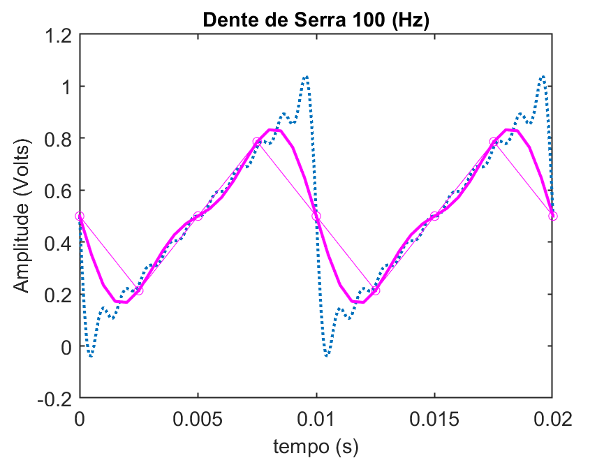

<!--title: Sinais & Sistemas -->

# Sinais & Sistemas I

* Série de Fourier ([Intro](4_fourier/4_serie_fourier.html))
* Transformada de [Laplace](3_transformada_laplace.pdf)
* Resposta Frequencial (ou [Diagramas de Bode](Diagramas_Bode_1.pdf))

&nbsp;
Outros tópicos:

* [Tutorial (rápido) sobre Matlab](https://fpassold.github.io/Matlab/tutorial.html).
* Recomendações sobre [Instalação do Matlab](https://fpassold.github.io/Matlab/instalacao_matlab.html).
* Tutorial (algo mais longo) sobre o Matlab ([aula de 26/10/2023](aula_26oct2023.html))
* [Tutorial (rápido) sobre o Octave](https://fpassold.github.io/Octave/octave_inicio.html).
----

Fernando Passold, em 19/10/2023
