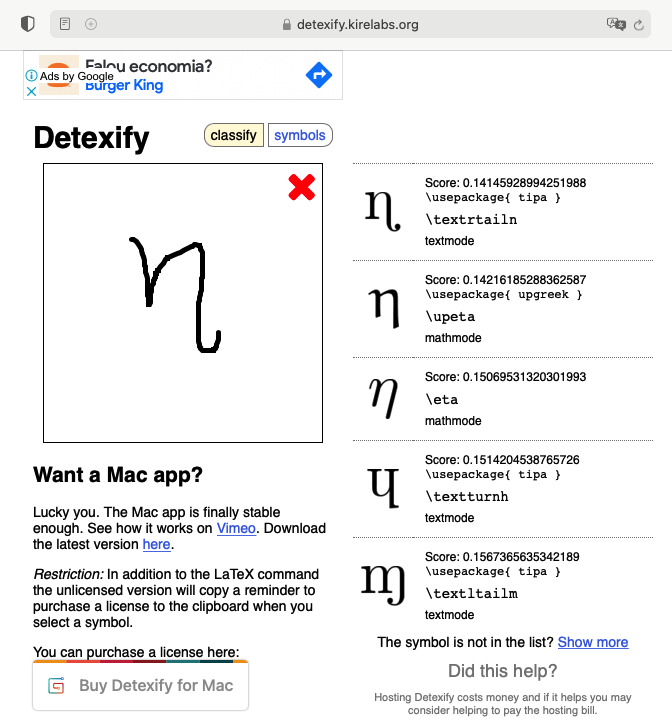
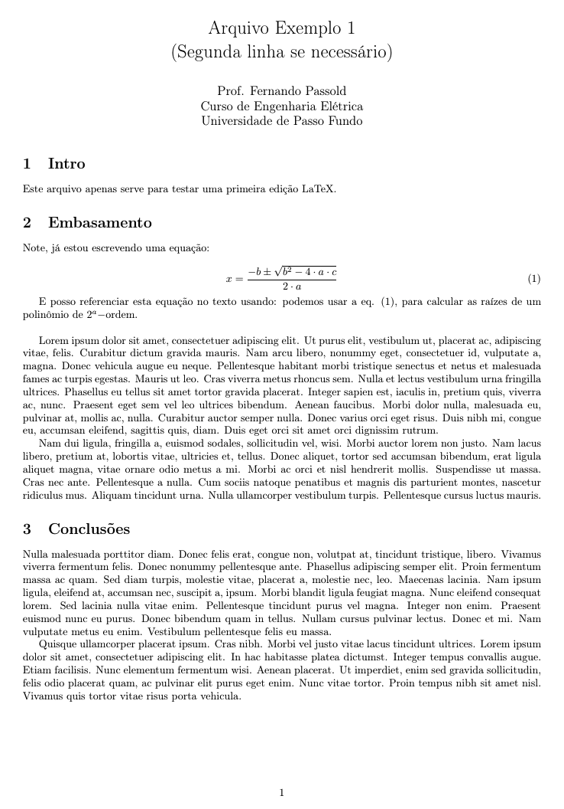
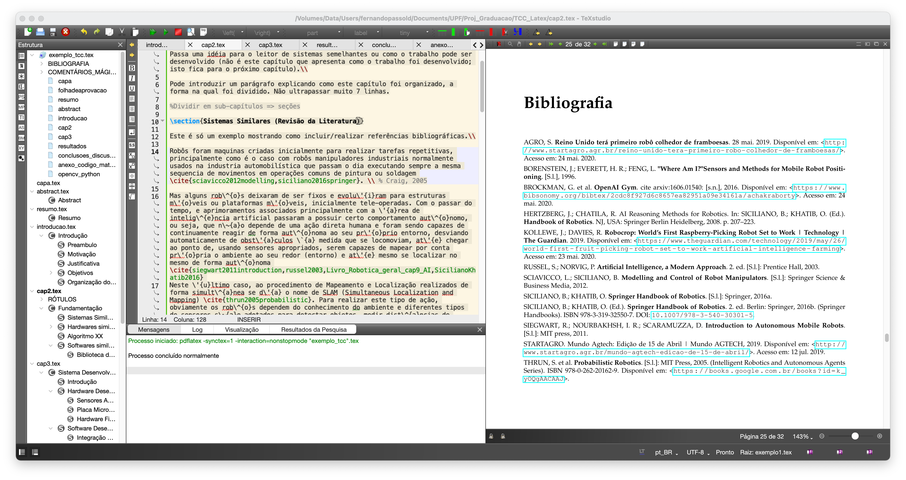
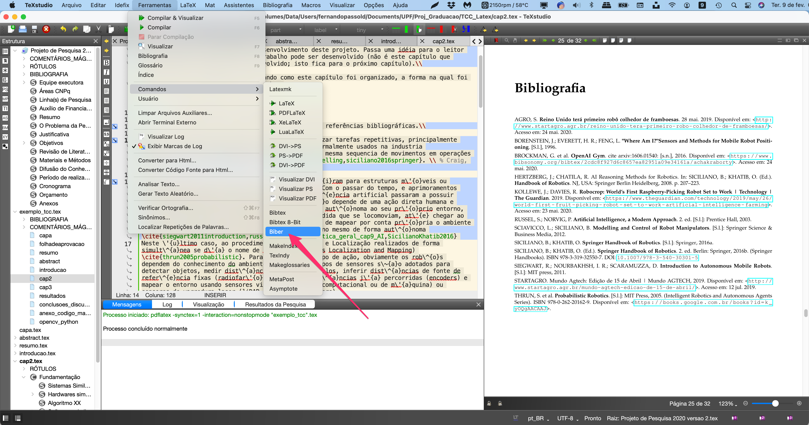
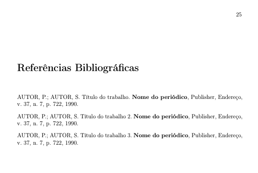

# Escrevendo TCCs usando LaTeX

Este documento sugere formas de editar um arquivo LaTeX para compor o documento final de um TCC, para o curso de Eng. Elétrica da UPF (não é um repositório oficial).

Para alunos novatos em LaTeX, seguem tutoriais:

* [*APOSTILA DE LATEX*](http://www.telecom.uff.br/pet/petws/downloads/apostilas/LaTeX.pdf). Programa de Educação Tutorial. Engenharia de *Telecomunicações*. Universidade Federal Fluminense. Niterói-*RJ*. Maio / 2008. ==recomendo== (introdução rápida e eficaz) - estava disponível ainda em 8/02/2021
* [["Learning.tex"]](http://www.cpdee.ufmg.br/~petee/ref/doc/minicursos_oficinas/latex/Apostila_LaTeX.pdf): Outro tutorial abordando uso do [[Overleaf]](https://www.overleaf.com) para edição LaTeX (online nas nuvenns), da pós graduação em engenharia elétrica da UFMG.

E "googlando" na internet você vai encontrar muitas informações mais sobre LaTeX.

Minhas recomendações para usar LaTeX:

1. Instalar algum pacote compatível com LaTeX na sua máquina.
   Isto varia um pouco se você usa Windows, Linux ou MacOS.

   1. No caso do Windows, recomendo instalar:

      - [[MikTex]](https://miktex.org): a modern TeX distribution for **Windows**, Linux and macOS;
      - Você pode tentar usar o [[TeX Live]](http://www.tug.org/texlive/), mas o MikTeX têm histórico de uso de longa data....

   2. No caso de Linux é fácil instalar (no Ubuntu), basta fazer:

      * Apt-get:

        ```bash
        $ sudo apt update
        $ sudo apt-get install texlive texlive-latex-extra texlive-lang-portuguese
        $ sudo apt-get install texlive-math-extra
        ```

   3. No MacOS recomendo instalar:

      * [[MacTeX]](http://www.tug.org/mactex/)

2. Instalar algum editor (de textos) mas próprio para edição LaTeX:

   1. Para Windows, Linux, Mac:

      * [[TeXstudio]](https://texstudio.org), (eu prefiro este) ou:
      * [[TeXnicCenter]](https://www.texniccenter.org).

      Obs.: Recomendo primeiramente instalar o pacote LaTeX e depois o editor, assim, o prórpio editor já se ajusta ao seu sistema localizando os caminhos apropriados para acesso ao compilador do LaTeX.

3. Recomendável instalar um editor de equações (principalmente) para novatos em LaTeX:

   * [[LaTeXiT]](https://www.chachatelier.fr/latexit/) - infelizmente só disponível para MacOS;
   * [[LKatexFormula]](https://klatexformula.sourceforge.io) - para Mac e Windows (similar ao LaTeXiT) e talvez para Linux;
   * [[TexMaths]](http://roland65.free.fr/texmaths/) - multiplataforma 
   * [**[Detexify]**](https://detexify.kirelabs.org/classify.html) - você desenha símbolos e ele tenta retornar o código LaTeX (online):
     


### Exemplo 1 de uso

Segue um primeiro exemplo, mostrando um arquivo super simples: "**exemplo1.tex**":

```tex
% !TeX spellcheck = pt_BR
\documentclass[10pt,a4paper,twoside]{article} %{report} %{article}
\usepackage{geometry}
\geometry{top=2cm,bottom=2cm,left=2.0cm,right=2.0cm}

\usepackage[brazil]{babel}  % hifenação em português
\usepackage[utf8]{inputenc} % Required for inputting international characters. MacOS
% \usepackage[latin1]{inputenc} % caracteres acentuados em portugues <-- usado no Windows
\usepackage[T1]{fontenc}    % Output font encoding for international characters

\usepackage{tracefnt} % faz o próprio sistema de compilação do LaTeX gerar mais informações à respeito

\usepackage{lipsum} % para preencher textos aleatórios para testes
% Exemplo: \lipsum[1-4]

\title{Arquivo Exemplo 1\\(Segunda linha se necessário)\)}
\author{Prof. Fernando Passold\\
	Curso de Engenharia Elétrica\\
	Universidade de Passo Fundo}
\date{}
\relax

\begin{document}

\maketitle

%\begin{abstract}
%\end{abstract}
	
\section{Intro}

Este arquivo apenas serve para testar uma primeira edição LaTeX.

\section{Embasamento}

Note, já estou escrevendo uma equação:

\begin{equation}\label{eq:equacao1}
	x=\frac{-b \pm \sqrt{ b^2 - 4 \cdot a \cdot c } }{ 2 \cdot a}
\end{equation}

E posso referenciar esta equação no texto usando: podemos usar a eq. (\ref{eq:equacao1}), para calcular as raízes de um polinômio de $2^a-$ordem.\\

\lipsum[1-2]

\section{Conclusões}

\lipsum[3-4]

\end{document}
```

Quando for compilado gera um arquivo PDF como:




**Algumas observações**:

No preambulo de um arquivo LaTeX (toda parte antes de "\begin{document}") se faz necessário indicar a condificação usada para seus arquivos. 

No caso de **arquivos editados no Windows**, é uma linha contendo:
`\usepackage[latin1]{inputenc} % caracteres acentuados em portugues. <-- usado no Windows` e o arquivo LaTeX ficaria algo como:

```tex
% !TeX spellcheck = pt_BR
\documentclass[10pt,a4paper,twoside]{article} %{report} %{article}
\usepackage{geometry}
\geometry{top=2cm,bottom=2cm,left=2.0cm,right=2.0cm}

\usepackage[brazil]{babel}    % hifenação em português
\usepackage[latin1]{inputenc} % caracteres acentuados em portugues. <-- usado no Windows
\usepackage{tracefnt} % faz o próprio sistema de compilação do LaTeX gerar mais informações à respeito

\usepackage{lipsum} % para preencher textos aleatórios para testes
% Exemplo: \lipsum[1-4]

\begin{document}


\end{document}
```

No caso de arquivos editados no **Linux ou MacOS**, é uma linha contendo:
`\usepackage[utf8]{inputenc}` - um arquivo LaTeX ficaria assim:

```tex
% !TeX spellcheck = pt_BR
\documentclass[10pt,a4paper,twoside]{article} %{report} %{article}
\usepackage{geometry}
\geometry{top=2cm,bottom=2cm,left=2.0cm,right=2.0cm}

\usepackage[brazil]{babel}    % hifenação em português
\usepackage[utf8]{inputenc} % Required for inputting international characters
\usepackage[T1]{fontenc} % Output font encoding for international characters

\usepackage{tracefnt} % faz o próprio sistema de compilação do LaTeX gerar mais informações à respeito

\usepackage{lipsum} % para preencher textos aleatórios para testes
% Exemplo: \lipsum[1-4]

\begin{document}


\end{document}
```


#### Sobre **linguagens** usadas num arquivo .tex

Se você necessitar escrever algo em inglês, o preambulo do arquivo ficaria:

 ```tex
% !TeX spellcheck = en_US
% !TeX encoding = UTF-8
%\documentclass[a4paper,10pt,DIV15]{scrartcl}
\documentclass[a4paper,10pt]{article}
\usepackage[english]{babel}
% \usepackage[brazil]{babel}

\usepackage{ucs} % and \usepackage[utf8x]{inputenc}
\usepackage[utf8x]{inputenc} % para o caso do Mac
%\usepackage[latin1]{inputenc} % caracteres acentuados em portugu�s. <-- usado no Windows

\usepackage[T1]{fontenc}
\usepackage{cmbright}   % Computer Modern Bright

%% arquivo continua...
 ```


## Exemplo para TCC

Segue abaixo um simples exemplo de arquivo "exemplo_tcc.tex" que pode ser usado para iniciar sua edição do arquivo .tex referente ao relatório do TCC.

Sugere-se a criação de um arquivo "main.tex" que "inclui" vários arquivos .tex diferentes, onde a ideia pricipal neste arranjo é que cada capitulo do documento seja um arquivo .tex separado, que pode ser editado independente do "main.tex". Lembrar apenas que no momento de compilar o arquivo, a compilação deve ser feita sobre o "main.tex".

No exemplo disponibulizado aqui, o arquivo principal possui o nome "**exemplo_tcc.tex**". Sua listagem segue abaixo:

```tex
% !TeX spellcheck = pt_BR
\documentclass[10pt,a4paper,twoside]{book}
\usepackage{geometry}
\geometry{top=2cm,bottom=2cm,left=2.0cm,right=2.0cm}

\usepackage[brazil]{babel}    % hifenação em português
\usepackage[utf8]{inputenc} % Required for inputting international characters
\usepackage[T1]{fontenc} % Output font encoding for international characters

\usepackage{tracefnt} % faz o próprio sistema de compilação do LaTeX gerar mais informações à respeito

\usepackage{lipsum} % para preencher textos aleatórios para testes
% Exemplo: \lipsum[1-4]

\usepackage[usenames,dvipsnames]{color}
\usepackage[table]{xcolor} % para trabalhar com \pagecolor{purple!30} e \rowcolors{<''starting row''>}{<''odd color''>}{<''even color''>}

\usepackage[pdftex]{hyperref} % ajustar opções de links interativos no PDF
\hypersetup{
	% colorlinks = true,
	colorlinks = false,
	linkcolor = blue,
	anchorcolor = blue,
	citecolor = blue,
	filecolor = blue,
	urlcolor = blue,
	linkbordercolor = cyan,
	urlcolor = magenta
}

%% Criando algumas definições
\def\instituicao{
	Universidade de Passo Fundo\\
	Curso de Engenharia Elétrica
}
\def\titulo{Título do Trabalho}
\def\autor{Siclano de Souza}
\def\local{Passo Fundo -- RS}
\def\data{Julho de 2021} % Mês e ano
\def\aprovadoem{-- Julho de 2021}

%% definindo parâmetros para sistema LaTeX
\title{Controle Automático III\\(Controle Digital)}
\author{Prof. Fernando Passold\\
	Engenharia Elétrica\\
	Universidade de Passo Fundo}

\usepackage{indentfirst} % identar primeiras linhas de cada seção/parágrafo
\sloppy % Ser "indulgente"!? no preenchimento das linhas - evita quebras de linha além do número de colunas normais disponíveis para cada linha de texto.
\relax

\usepackage{graphicx} % para poder incluir figuras

\usepackage{amsfonts,amsmath,amssymb} % para incluir equações matemáticas e símbolos especiais
\usepackage{xfrac} % Provides \sfrac{}
\usepackage{chemarrow} % para usar \autorightarrow{abc}{def}
\usepackage[makeroom]{cancel} % canceling therms on math expressions - http://tex.stackexchange.com/questions/75525/how-to-write-crossed-out-math-in-latex
% Use: \cancel{5y}, \bcancel{5y}, \xcancel{5y}, \cancelto{\infty}{5y}=0

\usepackage{caption} % reduce space between the caption and the figure is called skip (default is 10pt). - Ref.: http://tex.stackexchange.com/questions/94016/how-to-reduce-space-between-image-and-its-caption
\usepackage {enumerate} % para refinar ambiente "enumerate", por ex.: a), II)..

\usepackage {palatino} % fonte "elegante"

\usepackage{listings} % para incluir códigos formatados

%%%%%%%%%%%%%%%%%%%%%%%%%%%E
% Para incluir referências bibliográficas:
% Atenção: usado: biber ==> para compilar (incluir) as referências bibliográficas
% corretamente, você deve, depois de compilado ao menos 1x o arquivo .tex,
% optar pela opção Biber no momento de compilar Ref. Bib.
%%%%%%%%%%%%%%%%%%%%%%%%%%%
\usepackage[backend=biber, style=abnt, justify, giveninits, extrayear, repeatfields]{biblatex}
% Ref.: http://ctan.math.washington.edu/tex-archive/macros/latex/contrib/biblatex-contrib/biblatex-abnt/doc/biblatex-abnt.pdf
\addbibresource{learning.bib} % especifica o arquivo *.BIB à ser usado <<-- para biblatex!
% não esquecer de incluir a extensão *.bib senão "biber" não encontra o arquivo das referências..
% Atenção compliar usando "biber"... antes do run normal
% Ver.: http://ctan.math.washington.edu/tex-archive/macros/latex/contrib/biblatex-contrib/biblatex-abnt/doc/biblatex-abnt.pdf
% Comandos:
% \cite{amaral15} 
%   (AMARAL, 2015)
% \cites{moretti09}{mann09}{amaral15}
%   (MORETTI, 2009c; MANN, 2009; AMARAL, 2015)
% \textcites{moretti09}{mann09}{amaral15}
%   Moretti (2009c), Mann (2009) e Amaral (2015

%%%%%%%%%%%%%%%%%%%%%%%%%%%%%%%%%%%%%%%%%%%%%%%%%%%%%%%%%%%%%%%%%%%%%%%%%%%%%%%%
%%%%%%%%%%%%%%%%%%%%%%%%%%%%%%%%%%%%%%%%%%%%%%%%%%%%%%%%%%%%%%%%%%%%%%%%%%%%%%%%
\begin{document}

\pagestyle{empty}	
\include{capa} %pagina de titulo
\include{folhadeaprovacao} % folha aprovação
% pagina agradecimentos
\include{resumo} % pagina Resumo
\include{abstract} % pagina Abstract
\listoffigures % lista de figuras
\listoftables % lista de tabelas
\tableofcontents % Índice

\pagestyle {plain} % indica numerar próximas páginas

%% Iniciam capítulos do documento
% Sugere-se um arquivo tex para cada capitulo
\include{introducao}
\include{cap2}
\include{cap3}
\include{resultados}
\include{conclusoes_discussoes}

% Referências bibliográficas
\printbibliography[heading=bibintoc] % <-- add a ToC entry for the bibliography
\printbibliography % [title={Whole bibliography}] % <-- imprime referencias bibliográficas...

% Seguem anexos
\addcontentsline{toc}{chapter}{Anexos}
\appendix
\include{anexo_codigo_matlab_sensor_ultra}
\include{opencv_python}

\end{document}
```

Este arquivo "chama" vários ontros arquivos, como por exemplo: "**cap2.tex**":

```tex
%% cap2.tex == Fundamentação teórica
\chapter{Fundamentação}

Apresenta a teoria que foi usada para realizar o trabalho. Pode ser apresentado de forma cronológica, citando sistemas semelhantes (vantagens e desvantagens). Ao final apresenta o "estado da arte" associado com o desenvolvimento deste projeto. Passa uma idéia para o leitor de sistemas semelhantes ou como o trabalho pode ser desenvolvido (não é este capítulo que apresenta como o trabalho foi desenvolvido; isto fica para o próximo capítulo).\\

Pode introduzir um parágrafo explicando como este capítulo foi organizado, a forma na qual foi dividido. Não ultrapassar muito 7 linhas.

%Dividir em sub-capítulos => seções

\section{Sistemas Similares (Revisão da Literatura)}

Este é só um exemplo mostrando como incluir/realizar referências bibliográficas.\\

Robôs foram maquinas criadas inicialmente para realizar tarefas repetitivas, principalmente como é o caso com robôs manipuladores industriais normalmente usados na industria automobilística que passam o dia executando sempre a mesma sequencia de movimentos em operações comuns de pintura ou soldagem \cite{sciavicco2012modelling,siciliano2016springer}. \\ % Craig, 2005

Mas alguns rob\^{o}s deixaram de ser fixos e evolu\'{i}ram para estruturas m\'{o}veis ou plataformas m\'{o}veis, inicialmente tele-operadas. Com o passar do tempo, e aprimoramentos associados principalmente com a \'{a}rea de intelig\^{e}ncia artificial passaram a possuir certo comportamento aut\^{o}nomo, ou seja, que n\~{a}o depende de uma ação direta humana e foram sendo capazes de continuamente reagir de forma aut\^{o}noma ao seu pr\'{o}prio entorno, desviando automaticamente de obst\'{a}culos \`{a} medida que se locomoviam, at\'{e} chegar ao ponto de, usando sensores apropriados, serem capazes de mapear por conta pr\'{o}pria o ambiente ao seu redor (entorno) e at\'{e} mesmo se localizar no mesmo de forma aut\^{o}noma \cite{siegwart2011introduction,russel2003,Livro_Robotica_geral_cap9_AI,SicilianoKhatib2016} 
Neste \'{u}ltimo caso, ao procedimento de Mapeamento e Localização realizados de forma simult\^{a}nea se d\'{a} o nome de SLAM (Simultaneous Localization and Mapping) \cite{thrun2005probabilistic}. Para realizar este tipo de ação, obviamente os rob\^{o}s dependem do conhecimento do ambiente e diferentes tipos de sensores s\~{a}o adotados para detectar objetos, medir dist\^{a}ncias de obst\'{a}culos, inferir dist\^{a}ncias de fonte de refer\^{e}ncia fixas (radiofar\'{o}is), inferir dist\^{a}ncias j\'{a} percorridas (encoders) e mapear o entorno usando sensores visuais (vis\~{a}o computacional ou de m\'{a}quina) ou sensores de varredura laser (liDAR = laser rangefinders) \cite{Borenstein96,thrun2005probabilistic}.\\ %[Borenstein et al., 1996; Thrun et al., 2005].\\

Rob\^{o}s m\'{o}veis ou plataformas m\'{o}veis aut\^{o}nomas dependem do conhecimento do ambiente para se locomoverem e diferentes tipos de sensores s\~{a}o adotados para detectar objetos, medir dist\^{a}ncias de paredes, inferir dist\^{a}ncias de r\'{a}dio-far\'{o}is (intensidade do sinal) e mesmo para inferir dist\^{a}ncias j\'{a} percorridas (\textit{encoders}). Mas sensores s\~{a}o sujeitos \`{a} ru\'{i}dos de leitura e defeitos e de forma a melhorar valores de medição quanto ao ambiente, algum processo de fus\~{a}o sensorial deve ser empregado, combinando informações de dois ou mais sensores \cite{Borenstein96,siegwart2011introduction}.\\ %[Borenstein et al., 1996; Siegwart et al., 2011]. \\

Rob\^{o}s para agricultura s\~{a}o normalmente mais complexos na sua parte mec\^{a}nica porque requerem mecanis- mos de tração capazes de cruzar imperfeiç\~{o}es no terreno onde est\~{a}o se locomovendo (eventualmente saltando pedras e troncos de \'{a}rvores ca\'{i}dos no ch\~{a}o). Para n\~{a}o dizer que ainda trazem acoplado numa plataforma que \'{e} m\'{o}vel uma esp\'{e}cie de rob\^{o} manipulador na forma de uma garra ou pinça eventualmente sendo capaz de interagir com o entorno.\\

\cite{agroReinoUnidoTera2019} e \cite{kolleweRobocropWorldFirst2019} citam o exemplo de um rob\^{o} rec\'{e}m criado pela startup inglesa Fieldwork Robotics, uma spinoff da Universidade de Plymouth, na Inglaterra, desenvolvido para selecionar e colher framboesas. Trata-se de um \'{o}timo exemplo de integração sensorial, j\'{a} que o rob\^{o} \'{e} equipado com uma garra manipuladora (pinça) equipada com sensor de imagem 3D (c\^{a}mera de profundidade) e algoritmos de aprendizagem de m\'{a}quina e IA para analisar o grau de desenvolvimento de cada fruta. Notar que sua pinça \'{e} capaz de se aproximar gentilmente da fruta usando aprendizagem de m\'{a}quina. Segundo a proposta desta startup, este maquin\'{a}rio ser\'{a} capaz de colher 25 mil frutas por dia, 10 mil a mais que um humano. O processo ainda \'{e} um pouco lento, com o rob\^{o} levando pouco mais de 1 minuto por framboesa. Mas a empresa pensa em resolver este problema numa vers\~{a}o final com quatro braços operando simultaneamente, e assim a m\'{a}quina poder\'{a} identificar o grau de desenvolvimento da fruta em menos de 10 segundos. Na China j\'{a} existem rob\^{o}s colhendo tomates e testes est\~{a}o sendo realizados testes para colher couve-flor \cite{StartAgro2019Walmart}.\\

\section{Hardwares similares}

Introduz sistema similares já existentes (ou não). Pode apresentar de forma cronológica como sistemas semelhantes fora desenvolvidos ao logno da estória. Como eles foram evoluindo, que cada novo sistema trouxe de vantagens em relação aos anteriores.

\subsection{Sensores mais usados}

Aqui se apresentam variáveis (estados do sistema) que devem ser captados e se apresenta as diferentes possibilidades e tipos de sensores que podem ser empregados para captar cada tipo diferente de variável necessária para o sistema.\\

Aqui devem ser apresentados os diferentes tipos de sensores, características básicas dos mesmos. Algo pode ser comentado a respeito de sua "popularidade". Sugere-se apresentar um quadro/tabela com as principais características ao lado de uma figura do sensor -- por exemplo, ver figura XX.\\

\subsection{Kits de desenvolvimento}

% Breve explicação neste caso
Aqui pode-se apresentar placas ou sistemas quase prontos, apresentando suas principais características. Uma foto com tabela resumo ao lado é o ideal. A ideia aqui é passar para o leitor uma ideia da potencialidade de certo(s) sistema(s).\\

Se mais de um sistema for apresentado (ou está sendo selecionado), é **muito** interessante, terminar esta seção apresentando uma **tabela comparativa final** entre diferentes opções disponíveis. Esta tabela pode ser bastante útil para ressaltar grandes diferenças de valores entre diferentes produtos ou ressaltar grande diferenças de poder de processamento, quantidade de memória disponível para programação, clock de cada sistema, etc; por exemplo, vide tabela \ref{tab:comparativo_raspberry_jetson_nano}.\\

\begin{table}
	\begin{center}	
		\begin{tabular}{rll} \hline
			Característica: & RaspBerry Pi IV & NVidia Jetson Nano\\ \hline
			Clock: & ?? & ??\\
			Memória RAM: & ?? & ??\\
			GPU: & ?? & ?? \\
			VRAM: & (compartilhada) & (compartilhada) \\
			Pinos I/O: & 44? & 50? \\
			Conector Câmera: & Sim (tipo XX) & Sim (tipo ZZ) \\
			Custo Médio: & R\$ 300,00 & R\$ 500,00 \\ \hline
		\end{tabular}
	\end{center}
	\caption{Tabela comparativa entre placa RaspBerry Pi IV e NVidia Jetson Nano.}\label{tab:comparativo_raspberry_jetson_nano}
\end{table}


\section{Algoritmo XX}

Note, já estou escrevendo uma equação:

\begin{equation}\label{eq:equacao1}
	x=\frac{-b \pm \sqrt{ b^2 - 4 \cdot a \cdot c } }{ 2 \cdot a}
\end{equation}

E posso referenciar esta equação no texto usando: podemos usar a eq. (\ref{eq:equacao1}), para calcular as raízes de um polinômio de $2^a-$ordem.\\

\section{Softwares similares}

Aqui se apresentam como sistemas similares foram desenvolvidos usando que tipo de software, linguagem de programação, *framework*, etc. Aqui são apresentadas o caso de uso de bibliotecas especias como **OpenCV** (e alguns de seus comandos com rápidos exemplos), **Matplotlib** (biblioteca para gráficos do Python, similar ao Matlab). Aqui se apresentam as bibliotecas, recursos, repositórios externos disponíveis e se passa uma idéia do que pode ser desenvolvido com cada uma destas partes/recursos. Seria ótimo apresentar testes realizados pelo próprio mostrando resultados obtidos com o uso de certas ferramentas (e de forma sútil fica claro que o aluno estava se familiarizando com alguma ferramenta/recurso específico). Códigos (completos ou longos) \textbf{não são} apresentados aqui, se for desejado disponibilizar/apresentar algum código exemplo, usar **Anexos** e referenciar que o código usado para produzir a figura YY consta no anexo ZZ.

\subsection{Biblioteca de Software OpenCV}

Para processamento de imagens é comum a adoção da biblioteca gráfica **OpenCV**. A figura \ref{fig:findmyball2} mostra um exemplo de uso.

\begin{figure}[!hbt]
	\centering
	\includegraphics[width=0.35\linewidth]{figuras/find_my_ball_2}
	\caption{Resultado da rotina \textsf{find\_my\_ball.py} usando biblioteca OpenCv.}
	\label{fig:findmyball2}
\end{figure}

O código usado para gerar a figura acima é mostrado no anexo \ref{Anexo:OpenCV-Python}.

% fim do Captíulo 2.
```

E segue como exemplo, parte do arquivo "learning.bib" que contêm os dados das referências bibliográficas (mostrado aqui para passar a ideia deste tipo de arquivo no LaTeX):

```tex
@online{ArduinoSupportMATLAB,
  title = {Arduino {{Support}} from {{MATLAB}}},
  url = {https://www.mathworks.com/hardware-support/arduino-matlab.html},
  urldate = {2020-06-20},
  abstract = {Connect to and control Arduino inputs and outputs from MATLAB},
  file = {/Volumes/Data/Users/fernandopassold/Zotero/storage/I5GSXZS6/arduino-matlab.html},
  langid = {english}
}

@article{Arulkumaran_2017,
  title = {Deep Reinforcement Learning: {{A}} Brief Survey},
  author = {Arulkumaran, K. and Deisenroth, M. P. and Brundage, M. and Bharath, A. A.},
  date = {2017},
  journaltitle = {IEEE Signal Processing Magazine},
  volume = {36},
  pages = {26--38},
  date-modified = {2018-09-17 02:04:27 -0300},
  number = {6}
}

@article{arulkumaranDeepReinforcementLearning2017,
  title = {Deep Reinforcement Learning: {{A}} Brief Survey},
  author = {Arulkumaran, K and Deisenroth, M P and Brundage, M and Bharath, A A},
  date = {2017},
  journaltitle = {IEEE Signal Processing Magazine},
  volume = {36},
  pages = {26--38},
  number = {6}
}
```


Note que não será demonstrado nesta página o conteúdo de todos os arquivos chamados por "exemplo_tcc.tex". Notar que **todos os arquivos** foram disponibilizados de forma compactada no arquivo: [**[TCC_Latex.zip]**](TCC_Latex.zip).

Note que uma árvore de arquivos é criada para gerar o documento final:

```
/TCC_Latex % tree
.
├── abstract.tex
├── anexo_codigo_matlab_sensor_ultra.tex
├── cap2.tex
├── cap3.tex
├── capa.tex
├── codigo
│   ├── find_my_ball.py
│   └── teste_sonar.m
├── conclusoes_discussoes.tex
├── exemplo1.tex
├── exemplo_tcc.tex <--------------------------------- Arquivo principal ("main")
├── figuras
│   ├── 220px-Lego_Mindstorms_Sound_Finder.jpg
│   ├── RNfx.gif
│   ├── exemplo1.png
│   ├── exemplo_TeXStudio.png
│   ├── feedforward_error_learning.gif
│   ├── find_my_ball_2.png
│   ├── fun_red_bull.gif
│   ├── ref_bib_template_overleaf_monografia_abnt.png
│   ├── scara.jpg
│   └── sonar_test2.png
├── folhadeaprovacao.tex
├── introducao.tex
├── learning.bib
├── opencv_python.tex
├── resultados.tex
└── resumo.tex

2 directories, 26 files
```

A próxima figura mostra o ambiente de edição TeXStudio adotado para compilar este arquivo e gerar como resultado final o arquivo [**[exemplo_tcc.pdf]**](exemplo_tcc.pdf):



E na próxima figura é chamada a anteção para a forma como são geradas as referências bibliográficas. Antigamente o LaTeX usava o comando `% biblatex` para compilar os arquivo `.bib` associados à um arquivo `.tex`. Mas o exemplo mostrado aqui, usa um sistema mais recente chamado de **biber** para geração de referências bibliográficas com formatações complexas como é caso da ABNT 3.14 (de meados de 2018). E neste caso, usar o comando "BibTeX" para processar as referências bibliográficas vai incutir erros. Você deve intercalar o comando "**Biber**" ao procedimento de "rodar" o arquivo .tex cada vez que incluir uma nova referência bibliográfica no texto ou no arquivo `.bib`. No caso do TeXStudio, o "**Biber**" está "escondido" no menu:



E usar o comando "PDLaTeX" para gerar (compilar) o pdf final ou simplesmente clicar no botão "play ▶️" .

Boa sorte.


---

### Outras Sugestões

A medida que sua compreensão sobre o uso do LaTeX aumentar, você pode querer gerar arquivos mais elegantes e sofisticados, por exemplo:

* [[Overleaf: Gallery - Book]](https://pt.overleaf.com/gallery/tagged/book)

* [Exemplo de monografia (simplificada) brasileira escrita usando ABNT](https://pt.overleaf.com/latex/templates/monografia-brasil-abnt-modelo-simplificado/hzmsrdkfnrcy) --> 

  Obs: no Overfleaf, (Open as Template) acaba abrindo toda a estutura necessária para uma edição online deste documento.
  Segue abaixo apenas como exemplo, o arquivo "main.tex" (principal): 

  ```tex
  % ---
  % Criado por Diêgo Marques
  % Template (Modelo) Simplificado para monografias usando normas ABNT
  %
  % Os arquivos que formatam as referências não são de minha autoria.
  % O arquivo abntcite-alf.sty é o pacote abntex2cite, criado pelo projeto abntex (https://www.abntex.net.br/)
  % O arquivo abnt-num.bst foi publicado por Daniel Miranda em http://hostel.ufabc.edu.br/~daniel.miranda/abnt.bst
  
  % Para entender como este modelo é estruturado leia o arquivo LEIAME.txt
  
  % ---
  \documentclass[12pt, oneside, a4paper, english, brazil]{book}
  
  \usepackage[
   alf,                       % Para referencia alfabetica
   %num,                      % Para referencia numerica
   com-coorient,              % Mantem as opcoes com coorientador
   %sem-coorient,             % Remove as opcoes com coorientador
   com-prof-tres,             % Mantem o professor 3 da banca
   %sem-prof-tres,            % Remove o professor 3 da banca
   %com-prof-quatro,          % Mantem o professor 4 da banca
   sem-prof-quatro,           % Remove o professor 4 da banca
  ]{stmonograph}              % Pacote feito para este template
  
  \estiloref
  \input{dados}
  
  % \tikzset{external/force remake} % Forca as figuras tikz serem refeitas
  
  \begin{document}
  
  \selectlanguage{brazil}
  
  % ---
  % ELEMENTOS PRÉ-TEXTUAIS 
  % ---
  
  \include{extras/capa}
  \include{extras/folharosto}
  % \include{pre-textual/fichacatalografica}
  \include{extras/folhadeaprovacao}
  \include{extras/dedicatoria}
  \include{pre-textual/agradecimento}
  \include{extras/epigrafe}
  \include{pre-textual/resumo}
  \include{pre-textual/abstract}
  \listadefiguras
  \listadetabelas
  \sumario
  
  % ---
  % ELEMENTOS TEXTUAIS
  % ---
  
  \cabecalhos  % Configura os cabecalhos para os elementos textuais
  
  \include{textual/cap1} % Capitulo 1
  \include{textual/cap2} % Capitulo 2
  \include{textual/cap3} % Capitulo 3
  \include{textual/cap4} % Capitulo 4
  \include{textual/cap5} % Capitulo 5
  
  % ---
  % ELEMENTOS POS-TEXTUAIS
  % ---
   
  \asreferencias      % Insere as referencias
  \apendiceconfig     % Configura os apendices 
  
  \include{pos-textual/apendicea}  % Apêndice A
  
  \end{document}
  ```

  Obs.: para este arquivo funcionar localmente no seu computador será necessário baixar no mesmo diretório vários outros arquivos, especialmente: comandos.tex, stmonograph.sty (**muito importante neste caso**; note que dentro de `main.tex` é referenciado na parte: ``\usepackage[ ... ]{stmonograph}` ) e outros que dependem da estrutura de arquivos sendo criada): 

  Particularmente não são tão fã deste "template" porque usa de maneira "obscura" o comando para gerar **referências bibliográficas**. No caso são usados os arquivos `abnt-num.bst` e `abntcite-alf.sty` para definir a forma como deve ser gerada a informação para referências bibliográficas, junto com arquivo das referências (conforme esperado): `referencias.bib`:

  ```tex
  @article{exemplo,
    title={Título do trabalho},
    author={Primeiro Autor and Segundo Autor},
    journal={Nome do periódico},
    volume={37},
    number={7},
    pages={722},
    year={1990},
    publisher={Publisher},
    address = {Endereço}
  }
  
  @article{exemplo2,
    title={Título do trabalho 2},
    author={Primeiro Autor and Segundo Autor},
    journal={Nome do periódico},
    volume={37},
    number={7},
    pages={722},
    year={1990},
    publisher={Publisher},
    address = {Endereço}
  }
  
  @article{exemplo3,
    title={Título do trabalho 3},
    author={Primeiro Autor and Segundo Autor},
    journal={Nome do periódico},
    volume={37},
    number={7},
    pages={722},
    year={1990},
    publisher={Publisher},
    address = {Endereço}
  }
  ```

  Note que no texto (arquivo .tex) são usados comandos como:

  ```tex
  texto \cite{exemplo,exemplo2,exemplo3}
  ```

  para que sejam incluídas referências, o que faz gerar um PDF com:
  

  Mas é uma opção de uso. 

---

Fernando Passold, em 08.02.2021