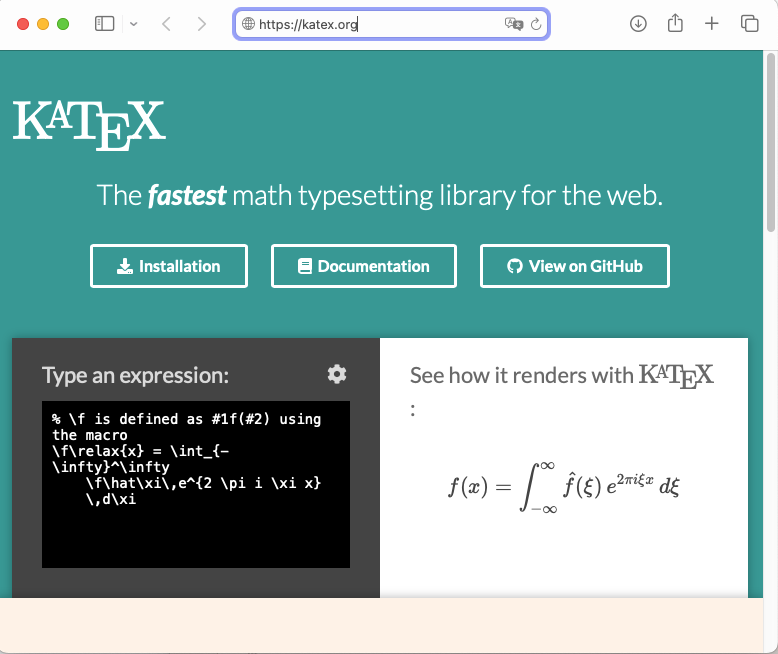
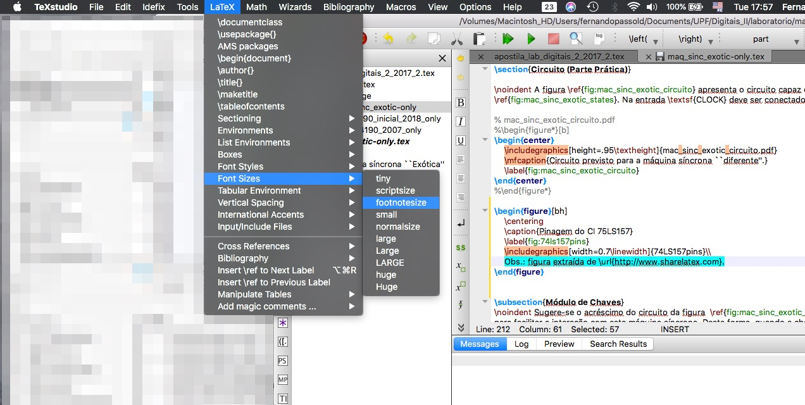

# 1. LaTeX - Dicas

- [1. LaTeX - Dicas](#1-latex---dicas)
  - [1.1. Instalação do LaTeX](#11-instalação-do-latex)
  - [1.2. Apostila Introdutória recomendada](#12-apostila-introdutória-recomendada)
  - [1.3. Editor Recomendado](#13-editor-recomendado)
  - [1.4. Para resolver dúvidas sobre LaTeX](#14-para-resolver-dúvidas-sobre-latex)
  - [1.5. Para editar equações no LaTeX](#15-para-editar-equações-no-latex)
  - [1.6. Inserir figuras e refenciá-las](#16-inserir-figuras-e-refenciá-las)
  - [1.7. Modificar tamanho de fonte em partes do texto](#17-modificar-tamanho-de-fonte-em-partes-do-texto)
  - [1.8. Corretor ortográfico no TeXstudio](#18-corretor-ortográfico-no-texstudio)
  - [1.9. Gerenciar Referências Bibliográficas](#19-gerenciar-referências-bibliográficas)
  - [1.10. Desenhar Diagramas em Blocos](#110-desenhar-diagramas-em-blocos)
  - [1.11. Formato ABNT Ref Bib](#111-formato-abnt-ref-bib)


## 1.1. Instalação do LaTeX

O LaTeX é na verdade um sistema para edição de documentos mais complexos, bem formatatos, agradavelmente estéticos e bastante consistente em estilos internos. Facilita muito a criação de índices, índices remissivos, lista de figuras e lista de tabelas. Porém exige uma pequena curva de aprendizado.

Para instalar LaTeX:

* no **Windows**, se recomenda a instalação do **[MiKTeX](https://miktex.org)**.
  
* no **Linux**, e *flavours* Debian (Ubuntu):</br>
    `$ sudo apt-get update`</br>
    `$ sudo apt-get upgrade`</br>
    `$ sudo apt-get install texlive-full biblatex abntex jabref texlive-fonts-extra klatexformula texlive-latex-extra texlive`

* no **Mac OS**, se recomanda o **[MacTeX](https://tug.org/mactex/)**.</br>
  Este ultimo app completo é bastante grande e pode ocupar muito espaço em disco.

Estes app's possuem em comum o fato de facilitar  a atualização e instalação de pacotes extras LaTeX (comum para usuários mais avançados), com excessão do Linux, onde o sistema LaTeX é atualizado usando o tradicional `sudo apt update & sudo apt upgrade`.

## 1.2. Apostila Introdutória recomendada

* **[Apostila](figuras/LaTeX.pdf)** organizada pelo grupo de Telecom da Universidade Federal Fluminense (RJ).

* [Cheat Sheet](figuras/latexsheet.pdf) - resumo com principais comandos. 


## 1.3. Editor Recomendado

Recomenda-se fortemente a instalação do **[TeXstudio](https://www.texstudio.org)**. Ele é free e multiplataforma (roda em Windows, Linux e Mac).

Existe um segundo editor mais antigo que o TexStudio e seu predecessor, o [TexnicCenter](https://www.texniccenter.org). Ele também é free e multi-plataforma. E parece que se dá melhor com o [MikTeX](http://www.miktex.org/) (pacote de instalação do LaTeX no Windows).

## 1.4. Para resolver dúvidas sobre LaTeX

Você pode "googlar" na internet para buscar soluções para seus problemas com o LaTeX, mas em especial se recomdam os seguintes sites:

* [Overleaf](https://pt.overleaf.com), por exemplo: como escrever [equações usando LaTeX](https://pt.overleaf.com/learn/latex/Display_style_in_math_mode).
    O site “Overleaf” permite editar online arquivos .tex — mas existe versão gratuita e limitada e versão paga para os arquivos mantidos na nuvem deles… O interessante é que muito gente começou a usá-los e eles acabaram se transformando numa fonte de help.
* outro site bom para resolver dúvidas específicas sobre LaTeX é o **StackExchange**. Por exemplo: pode-se introduzir equações dentro de tabelas? -- ver: https://tex.stackexchange.com/questions/112576/math-mode-in-tabular-without-having-to-use-everywhere 

## 1.5. Para editar equações no LaTeX

* Para descobrir que código LaTeX corresponde á certo símbolo matemático ou regra grega, recomenda-se o site **[Detexify](https://detexify.kirelabs.org/classify.html)**. Ele abre uma janela gráfica que permite que você desenhe (usando o mouse), o símbolo desejado. O site então ativa um sistema inteligente baseado em redes neurais para tentar identificar que comandos LaTeX mais se aproximam do símbolo desenhado, por exemplo:
    

* Outro site que permite editar (on-line) equações LaTeX é o [KaTeX](https://katex.org):
    

* Para o Mac OS existe o editor **[LaTeXiT](https://www.chachatelier.fr/latexit/latexit-home.php?lang=en)** que permite editar equações localmente (não é on-line) e mais interessante: permite exportar as equações criadas para outros programas, como sendo arquivos PDF ou PNG. E normalmente incorporando internamente no arquivo gerado, os comandos LaTeX usados para gerar a equação desejada, o que permite que se uma figura colocada no PowerPoint (ou Keynote) foi gerada através do mesmo, basta arrastar e soltar a figura na janela de edição do LaTeXiT para voltar a editar a equação (*mas atenção: talvez esta compatibilidade seja desfeita dependendo das versões usadas do LaTeXiT*). Mesmo assim, acredito que vale a pena tentar usar este app:
    

* Programas semelhantes ao anterior mas disponíveis para Windows podem ser testados, por exemplo:
  * [LaTeX Equation Editor](https://latexeqedit.sourceforge.net/index.php):
     
  * ou o [KLatexFormula](https://www.linuxlinks.com/klatexformula-generate-images-from-latex-equations/) para Linux:
    


## 1.6. Inserir figuras e refenciá-las

O editor **TexStudio** facilita bastante a inclusão de figuras durante a edição de um arquivo LaTeX, ele possui "**Wizards**" para incluir figuras (entre outras coisas), veja figura abaixo:


Abre-se uma nova janela:


E então basta ter selecionado o arquivo desejado:


Note que no campo “width/height” existe o valor 0.7 em relação à `\linewidth` — isto escalona automaticamente para sua figura ocupar 70% da largura do espaço disponível para texto. Se você mudar o tamanho das bordas (comando “geometry"), o próprio LaTeX depois da compilação do .tex, já aumenta/diminui sua figura de acordo.

Note ainda que existem opções para colocar texto explicativo da figura (`\caption`) acima ou abaixo da mesma:


Ao final, no arquivo .tex, fica algo como:


## 1.7. Modificar tamanho de fonte em partes do texto

Usando novamente o **TeXstudio**, para mudar tamanho da fonte (entre outras coisas), selecione a região do texto onde pretende usar outra fonte ou estilo de fonte e:



## 1.8. Corretor ortográfico no TeXstudio

Você pode configurar o TexStudio para corrigir textos em português ativando as preferências ou opções dele e baixando um dicionário de português (arquivo `.oxc`, ou algo assim) do pessoal do [LibreOfiice](https://pt-br.libreoffice.org/projetos/vero/) (*note: você não precisa instalar todo o LivreOffice; você vai apenas baixar uma extensão, o corretor ortográfico*). Dai tudo que você escreve e está com erros de português,  já aparece com aquele sublinhado típico do Word.

## 1.9. Gerenciar Referências Bibliográficas

Para trabalhar mais a sério com referências bibliográficas sugiro instalar e se cadastrar o **[Zotero](https://www.zotero.org)**. que facilita recuperar info bibliográfica de páginas da internet (depois de instalar plugins num Chrome ou Firefox da vida). 

Pode-se também instalar o **[JabRef](https://www.jabref.org)** para "editar no braço" referências bibliográficas (algumas vezes se faz necessário para certas referências bibliográficas).

## 1.10. Desenhar Diagramas em Blocos

Sugere-se usar o App on-line **[Draw.io](https://app.diagrams.net)** (do Google) para desenhos de diagramas de blocos ou fluxogramas. Como é parte do Google exige cadastro (conta gmail) no mesmo.

Mas o mais interessante é que existe um detalhe de configuração (habilitar uma opção especial para indicar que pretende inserir texto usando notação LaTeX) e iniciar equações LaTeX digitando pares `$$`  na parte do texto que pretenda que seja interpretada por algum sistema LaTeX, de forma semelhante ao que já se faz em editores compatíveis Markdown. Por exemplo, dentro de uma caixa retangular que é para representar uma planta de um sistema de controle, pode ser digitado algo como: `$$G(s)=\dfrac{80}{(s+1)(s+2)(s+4)}$$`:


Outro editor que pode ser instaldo localmente é o **[Dia Diagram Editor](http://dia-installer.de/index.html.en)**:


O **Dia** é multiplaforma e free. Instruções sobre como usar o **Dia** podem ser encontrados neste material organizado pela [USP](https://sites.icmc.usp.br/andretta/ensino/aulas/sme0230-1-10/aula-lab03-2.pdf). Ele permite desenhar:

* Fluxogramas:</br>
  

* Diagramas UML:</br>
  

## 1.11. Formato ABNT Ref Bib

o LaTeX pode trabalhar com diferentes estilos de referências bibiográficas -- usando a opção "**bibTeX**" (ver: [Overleaf: Bibtex bibliography styles](https://pt.overleaf.com/learn/latex/Bibtex_bibliography_styles)) ou pode usar uma opção separada de compilação (normalmente presente nos editores LaTeX), chamada de **[biblatex](https://pt.overleaf.com/learn/latex/Bibliography_management_with_biblatex)**.

Em todos os casos, o arquivo `.tex` é normalmente acompanhado de um arquivo do tipo `.bib` (outro arquivo texto) que traz dentro si, todos os detalhes necessários para gerar uma referência bibliográfica conforme o estilo desejado. Um arquivo `.bib` exemplo segue abaixo:

```latex
@article{einstein,
    author =       "Albert Einstein",
    title =        "{Zur Elektrodynamik bewegter K{\"o}rper}. ({German})
    [{On} the electrodynamics of moving bodies]",
    journal =      "Annalen der Physik",
    volume =       "322",
    number =       "10",
    pages =        "891--921",
    year =         "1905",
    DOI =          "http://dx.doi.org/10.1002/andp.19053221004",
    keywords =     "physics"
}

@book{dirac,
    title={The Principles of Quantum Mechanics},
    author={Paul Adrien Maurice Dirac},
    isbn={9780198520115},
    series={International series of monographs on physics},
    year={1981},
    publisher={Clarendon Press},
    keywords = {physics}
}

@online{knuthwebsite,
    author    = "Donald Knuth",
    title     = "Knuth: Computers and Typesetting",
    url       = "http://www-cs-faculty.stanford.edu/~uno/abcde.html",
    keywords  = "latex,knuth"
}

@inbook{knuth-fa,
    author = "Donald E. Knuth",
    title = "Fundamental Algorithms",
    publisher = "Addison-Wesley",
    year = "1973",
    chapter = "1.2",
    keywords  = "knuth,programming"
}
```

Para saber mais, se sugere uma visita à pagina da [Overleaf: Bibliography management with biblatex](https://pt.overleaf.com/learn/latex/Bibliography_management_with_biblatex#The_bibliography_file) e se sugere o uso de aplicativos extras para facilitar o gerenciamento de referênicas bibliográficas como o: [JabRef](https://www.jabref.org) (mais completo mas exige mais interação; nada automático)  ou [Zotero](https://www.zotero.org) (que pode automatizar a inclusão/captura de dados para referências bibliográficas diretamente à partir de páginas WEB mediante a instalação de plug-ins compatíveis com alguns browses como FireFox, Edge e Chrome, o "[Zotero Connector](https://www.zotero.org/download/#)").

Mas neste caso específico, estamos tendo a necessidade de compatibilizar o LaTeX com o sistema ABNT brasileiro.  Um processo algo chato, mas felizmente, algo recentemente (final de 2018) um grupo obstinado de entusiastas do LaTeX se atreveram a desenvolver uma ferramenta que permitisse obedecer as normas da ABNT para criação de documentos e referências bibliográficas. 

Se sugere fortemente que seja instalada a ferramenta "**[abnTeX2](https://www.abntex.net.br)**" (*ABsurd Norms for TeX*). Sua [página wiki no GitHub](https://github.com/abntex/abntex2/wiki/Instalacao) explica como instalar o abnTeX2. Uma seção da sua página Wiki explica [como iniciar o uso desta ferramenta](https://github.com/abntex/abntex2/wiki/PorOndeComecar#já-conheço-algo-de-latex-vou-usar-o-abntex2).

Provavelmente você trabalhará como o pacote de estilo:

* [abnTeX2cite](https://linorg.usp.br/CTAN/macros/latex/contrib/abntex2/doc/abntex2cite.pdf): bibliografia no formato ABNT NBR 6023, ou seja, gera algo: "Segundo a referência 117 entende-se que ..." (referência usando números).
* **[abnTeX2cite-alf](https://linorg.usp.br/CTAN/macros/latex/contrib/abntex2/doc/abntex2cite-alf.pdf)**: ==mais moderno==, que trabalha as referências bibliográficas no novo formato NBR 10520:2002, ou seja, no formato autor-ano, algo como: "E a pátria não poderia faltar (BRASIL, 1995).". Este estilo está próximo do estilo "original" do LaTeX (e mais adotado internacionalmente), o **[natbib](https://pt.overleaf.com/learn/latex/Natbib_bibliography_styles)** (usado fazendo-se: `\usepackage[round]{natbib}`) ou o estilo BibTeX [apalike]().

Neste último caso, ==no pre-âmbulo do seu arquivo `.tex`== constará uma declaração como:

```latex
\usepackage[alf]{abntex2cite} % Para usar o estilo de citação alfabético (seção 9.2 em 6023/2000 (ABNT, 2000))
```

Você pode então realizar referênicas bibliográficas no estilo:

* autos-data, usando o comando `\citeonline[opções]{label}`, algo como:

```latex
\citeonline[p.~146]{10520:2000:4.2-2} dizem que \ldots\
```

que gera algo como:

"Oliveira e Leonardos (1943, p. 146) dizem que ..."

Ou você pode usar o tradicional comando `\cite[opções]{label}`

```latex
‘‘Apesar da filosofia’’ \cite[p.~293]{10520:2000:4.1-2}.
```

que gera algo como:

"“Apesar da filosofia” (DERRIDA, 1967, p. 293)."

---

Fernando Passold, 2023.
