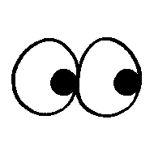
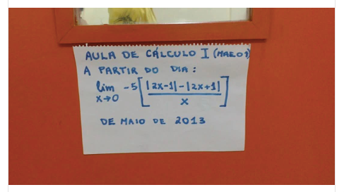

# Cursos Prof. Fernando Passold

 Dr. Eng. Fernando Passold ([Academia.edu](https://marcianazambillo.academia.edu/FernandoPassold), [Publons/Web of Science](https://www.webofscience.com/wos/author/rid/J-3070-2015), [Research Gate](https://www.researchgate.net/profile/Fernando\_Passold/info), [ORCID](https://orcid.org/0000-0002-9599-5914), [Slideshare](http://pt.slideshare.net/fpassold), [Google Scholar](https://scholar.google.com/citations?user=lvvFQ5YAAAAJ&hl=en), [LinkedIn](https://www.linkedin.com/in/fernando-passold-7a553b22/), [Personal YouTube](https://www.youtube.com/user/fpassold/videos), [Institutional YouTube](https://www.youtube.com/channel/UCF8lEIDVbtjLWNu1zXlJMVA/videos) ) - Prof. [Eng. Elétrica](https://www.upf.br/fear/curso/engenharia-eletrica/laboratorios) - [Universidade de Passo Fundo](https://www.upf.br/) 

"He toi whakairo, he mana tangata.'' 
(Where there is artistic excellence, there is human dignity) 
Maori proverb

# Cursos/Disciplinas ministradas:

| [Eletrônica Digital Combinacional](Digitais_1/index.html) (Antes: Circuitos Digitais I - Eng. Elétrica) | [Laboratório de Circuitos Combinacionais](Digitais_1/lab_dig1.html) (Eng. Elétrica/Eletrônica Digital I) |
| :----------------------------------------------------------- | :----------------------------------------------------------- |
| [Eletrônica Digital Sequencial](Digitais_2/digitais_2.html) (Antes: Circuitos Digitais II - Eng. Elétrica) | [Laboratório de Circuitos Sequenciais](Digitais_2/lab_digitais_2.html) (Eng. Elétrica/Eletrônica Digital II) |
| [Introdução à Sistemas Lineares](Sistemas_Lineares/index.html) (+2026/2) (Antes: [Sinais & Sistemas](Sinais_Sistemas/index.html)) | [Sistemas Amostrados](Sistemas_Amostrados/index.html) (+2016/2). |
| [Controle Automático 1](Controle_1/index.html) (Introdução à sistemas, modelagem e análise de sistemas/Eng. Elétrica)b |                                                              |
| [Controle Automático 2](Controle_2/index.html) (Controle Automático Clássico, Analógico - Eng. Elétrica, Eng. Computação) | [Laboratório de Controle Automático 1](Lab_Controle_1/index.html) (Lab. Controle Analógico - Eng. Elétrica, Eng. Computação) |
| [Controle Automático 3](Controle_3/index.html) (Controle Digital/Eng. Elétrica) | [Laboratório de Controle Automático 2](Lab_Controle_2/lab_controle_2.html) (Lab. Controle Digital - Eng. Elétrica, Eng. Computação (opcional)) |
| [Processamento Digital de Sinais](Process_Sinais/index.html) (Eng. Elétrica) | [Laboratório de Processamento Digital de Sinais](Lab_Processa_Sinais/index.html) (Eng. Elétrica) |
| [Processamento de Sinais & Controle Digital (ECP176)](Process_Sinais_Controle_ECP/index.html) (2026/2+)  Antes: [Processamento de Sinais & Controle Digital (ECP143)](Process_Sinais_Controle_ECP/index_2024.html) (2024/1) (Eng. Computação) |                                                              |
|                                                              | [Acionamento Hidráulico e Pneumático](Pneumatica/topicos.html) (Eng. Elétrica) |

&nbsp;

# Outras Informações

| [Instalação recomendada do **Matlab**](Matlab/instalacao_matlab.html) (áreas de: Controle e Sinais & Sistemas) | [Tutorial rápido sobre Matlab](Matlab/tutorial.html)         | **[Matlab\_guide.pdf](Matlab/Matlab_guide.pdf)** (tutorial mais longo, PDF de 44 páginas; 13.4 MBytes) |
| :----------------------------------------------------------- | :----------------------------------------------------------- | :----------------------------------------------------------- |
| **Octave on-line**  → http://octave-online.net/         | [Tutorial do **Octave**](Octave/octave_inicio.html) (Áreas de Controle e Sinais & Sistemas). |                                                              |
| [Introdução à **Python**](RNs/intro_python.html);            | [Uso do **Jupyter**](RNs/uso_Jupyter.html);                  | [Atalhos de **Teclado Jupyter**](RNs/atalhos_jupyter.html)   |
| [Uso do **VS Code**](RNs/Uso_VS_Code.html)                   | [Atalhos de **Teclado do VS Code**](RNs/Uso_VS_Code.html) | [Object Calisthenics & Code Clean](Python/Object_Calisthenics.html). |
| [Dicas para **estudantes de TCC**](TCC_Latex/index.html) (inclui dicas para escrita e dicas sobre ==$\LaTeX$==). | [Intro **Redes Neurais**](RNs/index.html)   | [Usando uma IA para resolvendo este "enigma":](Limite/limite.html)  |

----

  🏠 [Fernando Passold](https://fpassold.github.io/)[ 📬 ](mailto:fpassold@gmail.com) Página criada em Abril/2020 |  Atualizada em 07/102/2026.